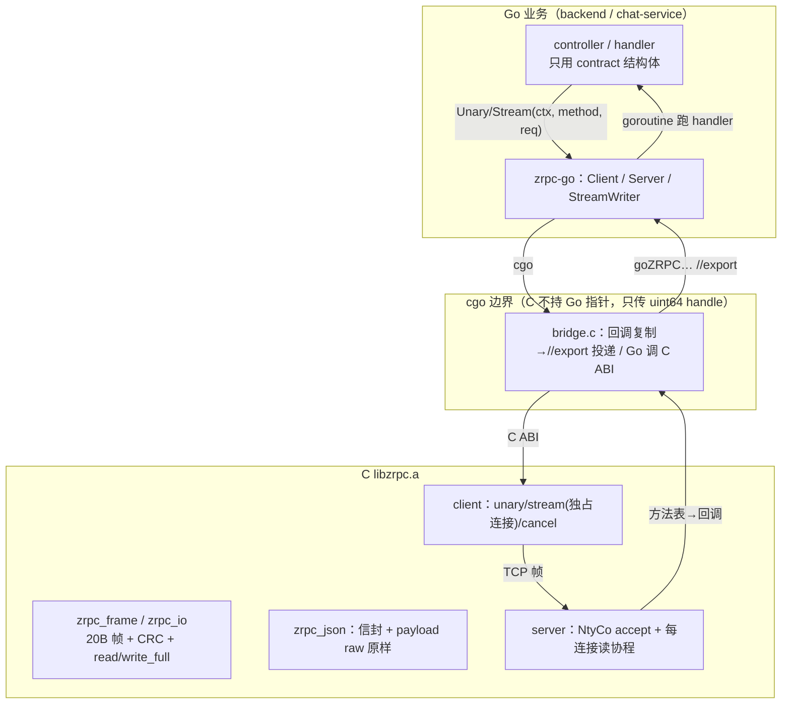
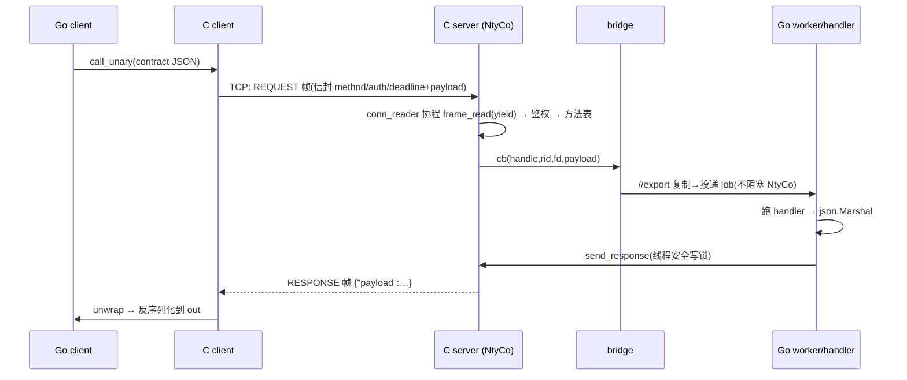
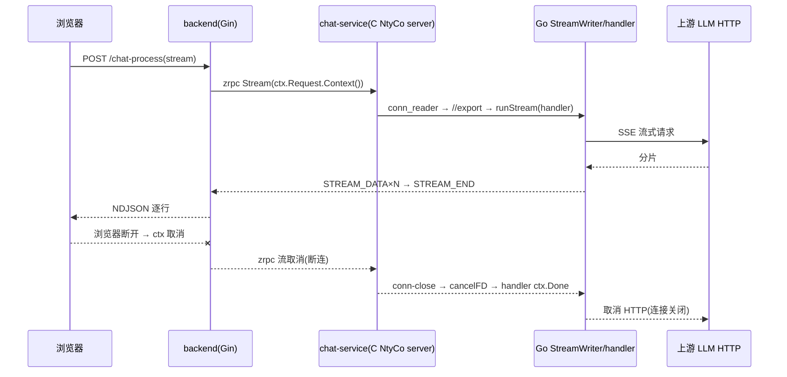

# zrpc v2：实现细节与在项目中的使用

状态：gRPC 已删，全链路仅自研 zrpc v2（单传输）。仓库目录：`third_party/zrpc/`（C 库）、
`zrpc-go/`（cgo bridge + contract）、三个服务使用点。

> 一句话定位：**C 写"内核"（协议/IO/并发），Go 写"外壳"（桥/业务）**。核心不是 Go 实现；
> Go 通过 cgo 调 C ABI，C 回调经 `//export` 回到 Go。

**增补（2026-09-08 · 以代码为准，格式对齐 `docs/项目文档/01-功能实现.md` 的「❓ 追问」块）**：全文件就地补充 **15 条「❓ 追问」块**（改用引用块展示，避免与正文混淆；每条给 `file:line` 与实盘行为）——§1.2：协程分支/两套 IO；§1.3：JSON 信封 vs 协议；§1.4：NtyCo 调度、回写与线程生命周期、回调进 Go 的约束、**zrpc 到底几个线程 / 回写为何不走协程**、**回写由哪个线程发、从哪发到哪**；§2：unary·unwrap·bridge·cgo 桥、契约与业务、unary vs stream、**为什么流 handler 临时起 goroutine 而 unary 不**、**三类 goroutine 的区别**、**全链路传输形态（前端流式 / proto 是否还在 / 各服务如何被 Go 调）**、**handler 结果回发到哪一跳（中间 handler 不直接回最终客户端）**。

## 0. 语言分工总览

| 层 | 语言 | 目录 | 职责 |
|---|---|---|---|
| 协议内核 | C | `third_party/zrpc/src/{zrpc_frame,zrpc_io,zrpc_json,zrpc_error,zrpc_client,zrpc_server}.c` | 帧/CRC、安全 IO、JSON 信封、方法表、鉴权、ping、客户端与服务器 |
| 协程并发 | C（NtyCo） | `third_party/zrpc/ntyco/` | **server** 的 accept/读协程调度（Go 侧/普通线程不经过它） |
| 静态库 | C | `third_party/zrpc/build/libzrpc.a` | 交付物；`make -C third_party/zrpc` |
| cgo 桥 | C shim + Go | `zrpc-go/bridge.c` + `client.go/server.go/stream.go` | Go↔C 双向：调用 C、`//export` 收 C 回调 |
| 契约 | Go | `zrpc-go/contract/` | 业务结构体（字段=proto json_name） |
| 业务 | Go | 三个服务 | 复用既有逻辑，仅换传输 |

**按"一次请求"切开的职责划分**（三层各做到哪一步就交棒）：

| 阶段 | 谁做 | 具体做了什么 | 边界 |
| --- | --- | --- | --- |
| **① 传输与协议** | **C（zrpc server + NtyCo）** | bind/listen/accept；每连接一个 `conn_reader` 协程读帧；校验 magic/ver/长度上限（4MiB）/CRC32；按帧类型分派（PING→PONG 免鉴权、REQUEST→业务、其它→`PROTOCOL_ERROR`+断连）；解 JSON 信封；**鉴权**（`ct_eq` 常量时间）；**deadline 过期检查**；**方法表路由**；调 bridge 回调投递；**回写**（套 `{"payload"}` + 封帧 + 每连接写锁，可从任意线程调）；断连通知；优雅停机；连接上限 `ZRPC_DEFAULT_MAX_CONN=1024` | **不理解业务语义**：不解析业务 JSON、不生成回答。做完鉴权+路由就把字节交出去 |
| **② 桥接与调度** | **Go（zrpc-go，框架层）** | cgo 双向桥；`handles` 表（uint64 handle → handler 函数）；`jobs` 队列（1024）+ **8 个 worker**；`runJob` 按 handler 类型分派（unary 就地 / stream 起 goroutine）；`StreamWriter`（Send/End/Error + ctx 取消注册到 `streamsByFD`）；`Server.Close` 有序停机；`Client`（Unary/Stream/Ping、断连唤醒） | **不含业务**：只管 Go↔C 的接缝（投递、调度、句柄、流写、生命周期） |
| **③ 业务** | **Go（chat-service）** | 注册 2 个方法（unary `chat.completion` + stream `chat.completion_stream`）；HTTP 健康口 8080；`Serve()` 起 worker；**编排**：敏感词(zrpc) → 语义缓存(kvstore + semantic + decision) → 关键词(zrpc) → 上下文(kvstore) → token 预算(tokenizer) → 调 LLM(proxy HTTP) → 流式回帧；收尾三分支；异步写上下文/落库/CacheWrite；ctx 贯穿到上游 HTTP（断连即取消） | **只管业务**：所有外部依赖（kvstore / semantic / tokenizer / proxy / MySQL / filter）都由这一层发起 |

> 两个容易忽略的事实：**a) chat-service 同时是 zrpc 服务端与 zrpc 客户端**（被 backend 调 `chat.completion_stream`，同时自己调 `filter.validate`/`filter.find_all`）——同进程两个角色，用 `zrpc.NewServer` / `zrpc.NewClient` 两个对象；**b) 三层之间唯一的数据纽带是"业务 payload 字节 + 几个标量"**（见 §7「C 投递到队列的到底是什么」），C 与 Go 之间**不共享任何指针**（C 只持 uint64 handle）。

**chat-service 的对外依赖：只有 3 处走 zrpc**（常被"链路上这么多服务"绕晕，这张表把它钉死）：

| 编排步骤 | 目标 | 载体 | 代码 |
| --- | --- | --- | --- |
| 流式回帧（**被动**：backend 调它） | backend ← chat-service | **zrpc（stream）** | 注册 `chat-server/server/zrpc.go:27-37`；handler `zrpc.go:40`；写流 `chatstream.go:20-24` |
| 敏感词校验 | sensitive `:50053` | **zrpc（unary）** | `services/keywords-filter/zrpc.go:69-80`（调用点 `app.go:316`） |
| 关键词提取 | keyword `:50054` | **zrpc（unary）** | `services/keywords-filter/zrpc.go:83-97`（调用点 `app.go:305`） |
| 语义缓存：`/embed`、`/v1/decision[/batch]` | semantic `:3003` | HTTP（1500ms） | `chat-server/semcache/semcache.go` |
| 上下文 / 明文 Q-A / 向量 VSEARCH / 指纹 | kvstore `:5160` | RESP（go-redis） | `chat-context/redis.go`、`semcache.go` |
| token 预算计数 | tokenizer `:3002` | HTTP | `chat-server/server/app.go` |
| 调大模型 | proxy `:8084` | HTTP（SSE 流式） | `chat-server/server/server.go:311-374` |
| 写聊天记录 | MySQL `:3306` | MySQL 协议 | `server.go:282-304` |

> 所以链路上虽然挂着 6~7 个依赖，**zrpc 只覆盖"两次几十字节的过滤调用 + 一条回答流的回程"**；缓存/向量/上下文在 RESP（kvstore），语义与模型在 HTTP。另外 `cmd/benchf/main.go:88` 还有一处 zrpc 客户端，但那是**压测工具**（独立 main、端口 50063），不在服务链路里。

## 1. C 内核实现细节

### 1.1 协议（zrpc_protocol.h / zrpc_frame.c）
- 帧：`magic 'ZR'(2B) | ver=2(1B) | type(1B) | request_id(8B BE) | len(4B BE) | crc32(payload)(4B)`，共 20B。
- 消息类型：REQUEST/RESPONSE/STREAM_DATA/STREAM_END/ERROR/CANCEL/PING/PONG。
- 分配前校验 `len ≤ MAX_FRAME_SIZE(4MiB)`，坏 magic/ver/type/CRC → `PROTOCOL_ERROR`，超长 → `FRAME_TOO_LARGE`。
- 所有整数大端、显式字节放置（无未对齐强转）；CRC 仅查损坏不做安全。
- 终态规则：unary 一个 RESPONSE/ERROR；stream 一个 `STREAM_END` 或 ERROR；收到终态删 pending。

### 1.2 安全 IO（zrpc_io.c）
`zrpc_read_full/write_full(_until)`：EINTR 重试、EAGAIN/EWOULDBLOCK 用 poll 等待、超时→`DEADLINE_EXCEEDED`、
对端关闭→`UNAVAILABLE`、写 0 字节视为异常、`MSG_NOSIGNAL`。
**协程分支**：当 `nty_coroutine_get_sched()!=NULL`（即运行在 NtyCo 协程内）时改用裸 `recv/send` 循环，
由 NtyCo 负责 yield——**绝不在调度线程上 poll 阻塞**。

> **❓ 追问：协程分支是什么意思？是不是同时用了 read/write 和 NtyCo 两套网络 IO？**
>
> **“是什么”**：`zrpc_io.c` 的读写函数在入口处先分叉一次（`in_coroutine()`＝`nty_coroutine_get_sched()!=NULL`，`zrpc_io.c:30-45`；sched 是按线程存 TLS 的，只有 NtyCo 调度线程上才有值，见「NtyCo 调度」追问）：
>
> - **非协程路径**（`sched==NULL`，即 C client 线程 / 任何 Go 线程）：`wait_ready(poll)` 等 fd 就绪 → 再 `recv/send`，带 wall-clock 超时（`zrpc_io.c:139-167 / 192-220`）。`_until` 变体共享一条 CLOCK_MONOTONIC 截止线。
> - **协程路径**（`sched!=NULL`，即调度线程上的 `conn_reader`/`server_main` 协程）：走 `co_read_full` / `co_write_full`（`zrpc_io.c:94-121`）——**不用 poll**，直接 `recv/send` 裸循环；`n==0` 判 UNAVAILABLE，`EINTR/EAGAIN/EWOULDBLOCK` 一律 `continue` 再试。
>
> **“为什么”**：链接进 libzrpc 后，`recv/send` 符号被 NtyCo 的同名 hook 覆盖（`ntyco/nty_socket.c recv:410-433 / send:500-532`）。hook 在 `sched!=NULL` 时会先 `nty_poll_inner`（把 fd 注册进调度器 epoll、把自己放进 waiting 红黑树、再 `nty_coroutine_yield` 把 CPU 交还调度器，`nty_socket.c:76-119`），等 epoll 报可读才被 resume 回来真正收一次。所以协程里的 `recv/send` **是“可让出”的**；若协程路径自己再调 `poll()` 阻塞等待，就会把**整条调度线程**卡死——其它所有连接的协程全部停摆。`co_*` 循环里的 `EAGAIN→continue` 正是“被唤醒但还没读到数据”的正常分支。
>
> **“是不是两套 IO 都用了”**：是的，同一份 `zrpc_read_full_until/write_full_until` 内部按“是否在协程里”选择实现：
> - 调度线程协程 → NtyCo hook 的 `recv/send`（非阻塞 fd + epoll + yield，无 poll）；
> - 普通/Go 线程 → libc `recv/send` + 自管 poll（`wait_ready`）实现阻塞+超时。
> 两套都落到同一组 socket 语义上，只是“谁来做等待”：协程路径由 **NtyCo 调度器（epoll）**负责，非协程路径由 **zrpc_io 自己的 poll**负责。C client（`zrpc_client.c`）跑在普通线程上，走的正是“poll + 阻塞 recv”那条；Go 侧回写（见「回写与线程生命周期」追问）也走非协程路径。
>
### 1.3 JSON 信封（zrpc_json.c + cJSON）
- REQUEST：`{"method","auth":"Bearer <token>","deadline_unix_ms","payload":<业务JSON>}`；
  业务 JSON 以 cJSON **raw 逐字嵌入/取出**，不重序列化（保字段序/数字）。
- RESPONSE/STREAM_DATA 块：`{"payload": <业务块>}`；客户端先 unwrap 再交给 Go。
- ERROR：`{"code","message","retryable"}`。

> **❓ 追问：JSON 信封和“协议”是什么关系？**
>
> 两者分属两层，别混：
>
> - **协议 = 传输层字节约定**（`zrpc_protocol.h`）：一条消息 = 20B 帧头（`magic 'ZR'(2B) | ver=2(1B) | type(1B) | request_id(8B BE) | len(4B BE) | crc32(payload)(4B)`）＋ payload。它负责“如何把一条消息切成可传输/可校验/可分帧的字节流”：类型（`zrpc_protocol.h:40-51`）、状态码（`zrpc_protocol.h:54-66`）、尺寸上限 `4MiB`（`:34`）、CRC 完整性、大端放置、终态规则（unary 一个 RESPONSE/ERROR；stream 一个 STREAM_END 或 ERROR，`:27`）。解析在 `zrpc_frame.c`。
> - **JSON 信封 = 帧 payload 里的 RPC 层 JSON 壳**（`zrpc_json.c`）：它回答“这一帧属于哪个方法、给谁鉴权、什么截止、业务体是什么”。
>   - REQUEST：`{"method","auth":"Bearer …","deadline_unix_ms","payload":<业务JSON>}`（`zrpc_json.c build_request:60-87`）；其中 `method/auth/deadline_unix_ms` 是**信封元数据**（路由键＋鉴权＋超时），`payload` 是**业务体**。
>   - RESPONSE / STREAM_DATA：`{"payload":<业务块>}`（`zrpc_json_wrap_payload:137-157`）；客户端先 unwrap（`zrpc_json_unwrap_payload:159-191`）再交给 Go。
>   - ERROR：`{"code","message","retryable"}`（`zrpc_json_build_error:195-214`）。
> - **“payload 业务体”以 cJSON raw 逐字嵌入/取出、不重新序列化**（`add_raw_member`，`zrpc_json.c:28-41`）——`cJSON_CreateRaw` 打印即原文，保证业务 JSON 的字段序、数字格式不被 cJSON 解析-重排破坏。
> - **两者叠加 = 一次 RPC**：C 侧先用协议层把帧读出来（校验 magic/ver/type/CRC/len），再按 type 分派；若是 REQUEST/RESPONSE 才进 JSON 层解信封。坏帧/坏信封分别回 `PROTOCOL_ERROR`。也就是说：**协议管“字节怎么走”，信封管“这一个请求是什么/带什么”**；业务 JSON 永远只是信封 `payload` 字段里原样搬运的一段文本（这也是 C 不做业务序列化、只做“剥壳/套壳”的由来）。
>
### 1.4 C server（zrpc_server.c）—— NtyCo 在这
- `zrpc_server_serve`：bind/listen 后起**一条 NtyCo 调度线程**，线程内建 `server_main`（accept 协程）。
- 每个连接再 `nty_coroutine_create` 一个 `conn_reader` 协程：`frame_read`（协程内 yield）→ PING 直接 PONG
  → REQUEST 解信封→鉴权（常量时间比较 Bearer）→查方法表→调注册回调（bridge cb）。
- **回调进 Go 的约束**：回调只把请求字节复制后 `//export` 投递给 Go worker 就返回，**不在 NtyCo 线程上做重活/阻塞**。
- **回写**：Go handler 完成后在任何线程调 `zrpc_server_send_response/send_stream_*`——走"每连接写锁 +
  非协程路径"，线程安全。
- 断连：conn_reader 退出前触发 conn-close 回调（`goZRPCOnConnClosed`）→ Go 取消该 fd 在途 stream 的 ctx。
- 优雅停机：`zrpc_server_shutdown`（假连接唤醒 accept、`shutdown(fd)` 唤醒各读协程）→ 协程退尽 →
  `nty_schedule_run` 返回 → `zrpc_server_join`。

> **❓ 追问：bind/listen 后起的“一条 NtyCo 调度线程”是怎么调度的？**
>
> 线程与协程怎么起来：`zrpc_server_serve` 在**调用方线程**上完成 getaddrinfo/socket/bind/listen（`zrpc_server.c:440-495`），再 `pthread_create` 一条调度线程跑 `scheduler_thread_main`（`:381-388`）。该线程刚进来还没有调度器，第一个 `nty_coroutine_create(&co, server_main, s)` 发现 `nty_coroutine_get_sched()==NULL` 就自动 `nty_schedule_create(0)` 建调度器并 `pthread_setspecific(global_sched_key, …)` 存进**线程 TLS**（`nty_coroutine.c:299-312`），然后 `nty_schedule_run()` 进入事件循环。之后每个 accept 到的连接再 `nty_coroutine_create` 一个 `conn_reader` 协程（`zrpc_server.c:371-372`）。
>
> 调度器内部（`nty_schedule.c`）用 4 个结构管状态：`ready` TAILQ（可运行）、`waiting` 红黑树（按 fd 键：在等某 fd 读/写就绪的协程）、`sleeping` 红黑树（定时/超时）、一个 epoll fd（`poller_fd`）。`nty_schedule_run()`（`nty_schedule.c:319-371`）是**单线程事件循环**，每轮：
>
> 1. **到点协程**：把 `sleeping` 树里到期的逐个 `nty_coroutine_resume`；
> 2. **跑 ready 队列**：逐条 resume（记录 `last_co_ready` 快照防止新协程插队导致无限循环）；resume＝`swapcontext` 切到协程栈执行，协程主动 yield/退出时切回调度器；
> 3. **等 epoll**：先算最近 `sleeping` 截止作为 epoll_wait 超时上限（`nty_schedule_epoll`/`min_timeout`），有 IO 事件就按 `fd` 在 `waiting` 树里找等待协程并 resume（`EPOLLHUP` 打 FDEOF 标志）；
> 4. 循环直到 `waiting/busy/sleeping/ready` 全空（`nty_schedule_isdone`），再 `nty_schedule_free` 返回。
>
> 协程怎么“让出等 IO”：被 hook 的 `recv/send/accept` 在调度线程上先走 `nty_poll_inner`（`nty_socket.c:76-119`）——把 `fd+事件` ADD 进 epoll、`nty_schedule_sched_wait` 把自己放进 waiting 树、`nty_coroutine_yield`（＝`swapcontext` 切回调度器）；等 epoll 报就绪，调度器 resume 它，它才真正 `recv/send`。协程栈：本 build 用 ucontext（`makecontext/swapcontext`），协程共享调度器一块栈、切进/切出时用 `_save_stack/_load_stack` 把协程自己的栈内容整体保存/恢复（`nty_coroutine.c:190-224,226-255`）——这就是文档 §6 说 ucontext 与 ASan 冲突、sanitizer 只能跑纯 C 的根因。
>
> **❓ 追问：回写会经过 C 的 server 吗？这些“线程/协程”是启动时就建还是临时建？**
>
> **回写经过 C、但不经过 NtyCo 协程/调度线程**。Go handler 算完（`server.go runUnary:198-227`）→ `json.Marshal` → `sendResp` 直接 `C.zrpc_server_send_response(...)`（`server.go:229-238`）。这条调用在 **libzrpc 内**：`zrpc_json_wrap_payload` 套壳 → `zrpc_frame_encode` 封 RESPONSE 帧 → `send_frame`（`zrpc_server.c:155-180`）→ `conn_lock_for_write`（先在连接表 `s->conn_lock` 里按 fd 找 `zrpc_conn_t`，再抢它的 **每连接写锁 `wlock`**）→ `zrpc_write_full` 直接在 raw fd 上写出去。因为是在普通线程（非协程）上调用，走的是 `zrpc_io` 的非协程 poll 路径（见「协程分支（两套 IO）」追问）。**它不需要经过 conn_reader 协程或调度线程来“代发”**——`conn_reader` 只负责读入与分发，写由任意线程经写锁直写。线程安全靠两点：连接表 `conn_lock`（防止连接被拆时用 fd）、每连接 `wlock`（串行化同连接的多写者，如并发 `Send`）。流式同样：`StreamWriter.Send/End/Error` → `C.zrpc_server_send_stream_data/end/error`（`stream.go:63-115`），同一路径。
>
> **线程/协程的生命周期**（哪些启动即建、哪些按需）：
>
> | 载体 | 创建时机 | 代码 |
> |---|---|---|
> | NtyCo 调度线程（1 条 OS 线程） | **启动即建**：`Serve()`→`zrpc_server_serve` pthread_create；`Close()`→shutdown/join 回收 | `zrpc_server.c:488 / 497-541` |
> | accept 协程 `server_main`（1 个） | **启动即建**（调度线程内首个协程） | `zrpc_server.c:385` |
> | Go 分发 worker（8 个 goroutine） | **启动即建**：`Serve()` 里 `go s.worker()`，常驻消费 `jobs` channel | `server.go:167-170` |
> | `conn_reader` 协程 | **每 accept 一个连接建一个**（临时，连接断则退） | `zrpc_server.c:371-372` |
> | 流 handler goroutine | **每个 stream 请求临时起一个**：`runJob` 里 `go s.runStream(...)`；unary 则在常驻 worker 上直接跑，不临时起 | `server.go:192` |
> | 客户端流 goroutine | **每条流临时起**（`Client.Stream` 内 runStream + 一个 ctx 观察 goroutine） | `stream.go:346-410` |
>
> 注意：Go 的 goroutine 不是 OS 线程；“8 个 worker”是 goroutine 常驻池。unary handler 都在这 8 个里轮流执行；只有流式 handler 每次 new 一个 goroutine。真正“启动即建的 OS 线程”只有那条 NtyCo 调度线程；Go 运行时自己的 M 是它内部按需增减的，不属于本设计。
>
> **❓ 追问：“回调只投递、不进 NtyCo 线程做重活”是什么意思？实际业务还是在 Go handler 里做吗？C 只是转发吗？**
>
> **约束的根因**：请求回调 `zrpc_bridge_server_cb` 是在 **NtyCo 调度线程上的 `conn_reader` 协程**里被调用的（`zrpc_server.c handle_request:281-282` → bridge）。整条调度线程靠协程轮流跑所有连接；若在回调里直接做重活/阻塞（比如就地发 HTTP 调 LLM），会**卡死整条调度线程**、其它连接全部停摆。所以回调体被严格压成“只搬数据”：
>
> ```c
> /* bridge.c:59-77 —— 复制请求字节 → //export 投递给 Go → 立即返回；请求字节不跨调用存活 */
> void *copy = malloc(request_len); memcpy(copy, request, request_len);
> goZRPCDispatchRequest(handle, rid, fd, copy, request_len, deadline); /* 同步但快 */
> free(copy); return 0;
> ```
>
> `//export goZRPCDispatchRequest`（`server.go:262-282`）本身也只做：`C.GoBytes` 复制一次 → `handleGet` 查表 → `select { jobs <- … : default: 丢弃并记日志 }`——**有界 channel（容量 1024）非阻塞投递，绝不阻塞 NtyCo 线程**；满则丢请求（客户端侧超时兜底）。
>
> **实际业务确实在 Go handler goroutine 里**：常驻 worker（`server.go:174-196`）从 `jobs` 取到 job → `runJob`：unary 直接在 worker 上 `fn(ctx, raw)`（`server.go:198-227`）；stream 则 `go s.runStream(ctx, raw, w)` 另起 goroutine 跑 handler（`stream.go:162-186`），真正的敏感词过滤、语义缓存、上下文拼装、调大模型流式转发全在这一层。handler 结果按「回写与线程生命周期」追问所述的回写路径送回。
>
> **C 只是转发吗**：对“业务字节”而言——是：C 不解释业务 JSON、不生成回答，只把 `payload` 业务体原样剥出给 Go、再把 Go 的返回原样套壳写回（raw 嵌入，见「JSON 信封与协议」追问）。但 C 绝不是“无脑转发”：帧/CRC 校验、信封解析、**常量时间 Bearer 鉴权**（`zrpc_server.c:83-90,233-243`）、deadline 过期检查、方法表路由、PING→PONG、每连接读协程与写锁并发、断连通知、优雅停机——这些都是 C 在连接进入 Go 之前/之后替 Go 做掉的“传输与并发内核”。一句话总结职责边界（即 §0 那行）：**C 写内核（协议/IO/并发），Go 写外壳（桥/业务）；C 负责把“对的人（鉴权后的请求字节）”高效送到 Go，Go 负责把它变成“对的答案”，再经 C 送回。**
>
> **❓ 追问：那整个 zrpc server 是不是只有两个线程？协程只负责读入和分发吗？Go handler 的结果不通过协程发送是为什么？**
>
> **先纠“两个线程”**：常驻的**专用 OS 线程只有 1 条 = NtyCo 调度线程**（每个 `zrpc.Server` 一个）；协程（`server_main` + 每连接 `conn_reader`）**不是线程**，只是这条调度线程上的用户态任务。除它之外，Go 运行时自己按需维持若干 **M（OS 线程）**——8 个 worker、各 handler goroutine、HTTP/metrics 全落在这些 M 上。所以服务端 = “**1 条专用调度线程 + Go 运行时的若干线程**”，不是“两条”。客户端进程根本没有 NtyCo 调度线程，只有 goroutine（跑在 Go 的 M 上）。
>
> **协程确实只干“读 + 分发 + 控制”**：accept 协程接新连接；每个连接一个 `conn_reader` 协程循环 `frame_read`（协程内 yield），读到 REQUEST → 解信封/鉴权/查方法表 → 回调把业务字节交到 Go 就返回（见「回调进 Go 的约束」追问）；PING→PONG、断连通知、停机唤醒也都发生在读侧。**写回完全不进协程**。
>
> **handler 结果为什么不“通过协程”发？** 两点：
> 1. **异步来源不匹配**：回答产自**任意 Go goroutine**（unary 在某个 worker 完成、stream handler 在任一时点 push 分片）。若让协程代发，就要做“Go 线程 → 跨线程唤醒调度线程 → 把写任务挂到某协程”的整套机制（eventfd/队列+握手），复杂度高，还会把 goroutine 生命周期和 NtyCo 调度绑死。
> 2. **没必要**：往 TCP socket 写不依赖读协程状态。写侧只要在连接表里按 fd 找到连接（`conn_lock` 保护、防连接被拆/fd 复用）→ 抢该连接的 `wlock`（串行化并发写者）→ `zrpc_write_full` 直接写（非协程 poll 路径）就够了（`zrpc_server.c send_frame:155-162`）。读协程只在自己 read 时让出，写线程按自己节奏写同一个 fd，TCP 全双工互不干扰。
>
> 所以准确说法是：**结果确实“经 C 发出去”**（走 libzrpc 的 `zrpc_server_send_*` 封帧 + 每连接写锁 + 直写 socket），只是**不经 NtyCo 协程/调度线程**——读归协程、写归各 Go 线程，各管一半互不阻塞，这正是“每连接写锁 + 非协程路径”线程安全设计的全部意义。
>
> **❓ 追问：回写到底是 Go 的哪个线程在发？从哪发到哪？**
>
> **没有专门的“发送线程”，回写发生在“完成 handler 的那个 goroutine 当前所跑的 Go 运行时线程（M）”上**：
>
> - unary：常驻 worker goroutine 跑 `runUnary` → handler 返回 → `json.Marshal` → `sendResp` → `C.zrpc_server_send_response(...)`（`server.go:198-238`）。整段就是**同一个 worker goroutine**；它在哪个 M 上执行，回写就在哪个 M 上发生（cgo 进 C 期间该 goroutine 会临时钉在当前 OS 线程上，写 socket 的这个 C 调用也就在这条 M 上完成）。
> - stream：流 handler goroutine（或它派生的 goroutine）在任意时刻调 `StreamWriter.Send/End/Error` → `C.zrpc_server_send_stream_*`（`stream.go:63-115`），同样在**当前 M** 上直接执行 C 写。
>
> 所以“哪个线程”没有固定答案——取决于 Go 调度器此刻把这条 goroutine 放到哪个 M 上；**不是 NtyCo 调度线程**（它只在读侧），也**没有写线程池**。并发安全不靠“固定线程发送”，而靠**每连接写锁 `wlock`** 串行化同 fd 的多写者。
>
> **从哪发到哪（一次回写的完整路径）**：
>
> ```text
> 服务端进程内: Go 堆里的结果字节(JSON) →(cgo 边界)→ libzrpc 封 {"payload":…} 信封
>   → 封 20B 帧(RESPONSE/STREAM_DATA) → 对该条连接对应的 socket fd send()
>   → 内核 TCP 发送缓冲 → 网线/loopback
> 对端进程: 该连接的 C client 收帧 → unwrap 业务 JSON → 反序列化交给调用它的 Go goroutine
> ```
>
> 关键：**回写物理上只到达“同一条 TCP 连接的另一端”**。zrpc 本身不知道“浏览器”在哪，它只是把这一跳的响应送回这一跳的调用方——至于调用方拿到后是继续下一步、还是结束给最终用户，见下一小节（§2 全链路追问）。若把“发送线程”具象成一个画面：就是那个刚跑完 handler 的 goroutine，在它正待着的 Go 线程上，直接把这个 fd 的帧写出去。
>
### 1.5 C client（zrpc_client.c）
普通线程阻塞 IO（不经 NtyCo）：`call_unary`（可复用连接）、`call_stream`（**每条流独占连接**，
逐块 unwrap 后回调，`STREAM_END/ERROR` 为终态）、`cancel`（`shutdown(SHUT_RDWR)` 唤醒阻塞读，无 fd 复用竞争）。

## 2. Go 桥与业务使用（zrpc-go）

> **❓ 追问：unary 是什么？unwrap 是什么？bridge 干什么？C server 是“中转”吗？**
>
> - **unary**＝一问一答的同步 RPC：客户端发 1 个 REQUEST，服务端回 1 个 RESPONSE（或 ERROR）即终态。C client `zrpc_client_call_unary`（`zrpc_client.c:212-282`）在一条**可复用连接**上：拼 REQUEST 帧 → write → 阻塞读一帧 → RESPONSE 就 unwrap、ERROR 解析 `code`。Go 侧 `Client.Unary`（`client.go:92-127`）包这一趟并把 C 返回码映射成 `*StatusError`。服务端 handler 形态 `func(ctx, raw json.RawMessage) (any, error)`（`RegisterUnary`，`server.go:142-144`）。
> - **unwrap（解包）**＝把帧 payload 里的信封壳剥掉、取出**业务 JSON**。收方向：客户端对 RESPONSE/STREAM_DATA 帧调 `zrpc_json_unwrap_payload`（`zrpc_json.c:159-191`）得到 `{"payload":<业务体>}` 里的业务体，再 `json.Unmarshal` 进 contract 结构体；发方向相反是 wrap（`zrpc_json_wrap_payload:137-157`）。服务端收请求则用 `zrpc_json_parse_envelope`（`zrpc_json.c:89-124`）解出 method/auth/deadline（元数据）并把 payload 业务体交给回调。业务 JSON 全程 **raw 逐字搬运、不重序列化**（见「JSON 信封与协议」追问）。
> - **bridge（`zrpc-go/bridge.c`）**＝把 C 库和 Go 缝在一起的 **C shim，连通 C 与 Go（双向）**：
>   - **Go→C**：Go 通过 cgo 直接调 `C.zrpc_server_*` / `C.zrpc_client_*`（见「cgo 桥」追问）；
>   - **C→Go**：C 回调经 bridge 反查 Go。每个 method 注册到 C 时都用**同一个回调 `zrpc_bridge_server_cb`**（`bridge.c:19-24,59-77`）——它复制请求字节后调 Go 的 `//export goZRPCDispatchRequest`（server 分发）；另外 `zrpc_bridge_conn_close`→`goZRPCOnConnClosed`（断连），`zrpc_bridge_stream_cb`→`goZRPCOnStreamEvent`（客户端流事件）。
> - **C server 是“接收客户端数据再调 Go handler”的中转吗？** 方向对，但 C 不是空转的转发器：它承接**网络内核**——accept（NtyCo 协程）、逐连接读协程、20B 帧 + CRC 校验、信封解析、鉴权（常量时间 Bearer 比较）、deadline 过期检查、方法表查 handler、PING→PONG、连接生命周期/优雅停机，确认了“这是哪个已注册方法”之后，才把业务字节经 bridge 交给 Go worker。也就是说 **C = 传输/协议/并发内核 + 分发，Go = 业务执行**；C 是中转者，但“中转”之上的协议与并发全是它做的（§0 那行“C 写内核、Go 写外壳”）。
>
> **❓ 追问：cgo 桥是怎么做的？用在哪里？**
>
> 机制分两半：
>
> 1. **Go 调 C（出）**：Go 包 `import "C"` + 头部 `#cgo CFLAGS/LDFLAGS` 声明包含路径并链接 `build/libzrpc.a`（`server.go:3-9`），于是 Go 里直接写 `C.zrpc_server_new`、`C.zrpc_server_serve`、`C.zrpc_server_send_response`、`C.zrpc_client_*` 等，参数用 `C.CString/C.uint64_t/C.int` 显式转换，`C.free` 释放（如 `NewServer` `server.go:106-134`）。
> 2. **C 调 Go（回）**：Go 侧用 `//export` 导出函数——`goZRPCDispatchRequest`（`server.go:262-282`）、`goZRPCOnStreamEvent` / `goZRPCOnConnClosed`（`stream.go:207-218,316-332`）。cgo 生成对应的 C 原型；bridge.c 顶部自己写一份**同签名声明**再调用（`bridge.c:12-17`）。
> 3. **C 永不持有 Go 指针，只传 `uint64` handle**：`Register*` 时 Go `handleAdd` 把 handler 放进 map、分配递增 id（`server.go:53-59`），把 id 作为 `handler_handle` 存进 C 方法表（`zrpc_server.c:267-273`，C 只当不透明数）；C 回调把 id 带回，Go `handleGet`（`server.go:61-65`）取回 handler 和所属 Server。客户端流句柄同理（`cstreamAdd/Get`，`stream.go:295-313`）。
> 4. **跨语言内存纪律**：C 回调里 `malloc+memcpy` 复制请求字节（`bridge.c:63-76`）；`//export` 内 Go `C.GoBytes` 在同步调用期间再复制一次（此刻安全），C 侧随后 `free`。Go 发数据时 `unsafe.Pointer(&data[0])` + `runtime.KeepAlive(data)`（`server.go:229-238` / `client.go:108-118`），保证 C 写 socket 期间 Go 字节不被回收/移动。
> 5. **C 线程回调进 Go 的形态**：NtyCo 调度线程是 C 创建的 pthread，它调 `//export` 时 Go runtime 会给这条陌生线程临时绑一个 M（needm）来执行导出函数——所以导出函数**必须快**（只复制+投递），这正是「回调进 Go 的约束」追问里“只投递不阻塞”的技术背景。
>
> **用在哪**：凡用 `echo-zrpc-go` 包的地方都是 cgo 桥——backend（chat-service 的客户端，`services/ai-chat-service/…`）、ai-chat-service（服务端 + 下游敏感词/关键词客户端，`services/keywords-filter/zrpc.go:69-97`）、keywords-filter（两个服务端实例）。整条链路 = Go 编/解码**业务 JSON（contract）**，C 管**传输与并发**，二者经这座桥互相调用。
>
### 2.1 服务端
```go
srv, _ := zrpc.NewServer(zrpc.ServerOptions{Address: "0.0.0.0:50055", AccessToken: cfg.Server.AccessToken})
srv.RegisterUnary(contract.MethodFilterValidate, func(ctx context.Context, raw json.RawMessage) (any, error) {
    var req contract.FilterRequest
    _ = json.Unmarshal(raw, &req)
    return contract.ValidateResponse{OK: ok, Keyword: w}, nil
})
srv.RegisterStream(contract.MethodChatCompletionStream, chat.ServeChatStreamZRPC) // handler 收 *StreamWriter
_ = srv.Serve()
// 退出: srv.Close()  // 优雅停 + 清 handle/worker
```
- handle 注册表：`Register*` 分配 `uint64 handle`（C 永不持 Go 指针），`Close` 清空（`RegisteredCount()==0`）。
- 请求分发：C 回调 → `//export goZRPCDispatchRequest`（仅复制、投递有界 channel，**不阻塞 NtyCo**）→
  Go worker（goroutine）跑 handler → 结果经 C 回写。
- 流：`StreamWriter.Send(v)/End()/Error(err)`；断连时 writer ctx 取消 → handler 可选 `ctx.Done()` 取消上游 LLM。
- panic 恢复 → `INTERNAL`；错误码稳定（`*StatusError{Code}`）。

**全项目注册到 zrpc 的 Go handler 清单（一共 4 个：3 unary + 1 stream）** —— 只有**两个进程**创建 zrpc server（`grep "zrpc.NewServer"` 仅命中 `keywords-filter/filter-server/main.go:39` 与 `ai-chat-service/chat-server/main.go:75`）：

| 进程 | handler 函数 | kind | 方法名 | 生产调用方 |
| --- | --- | --- | --- | --- |
| `keywords-filter`（sensitive 实例 :50053） | `validateZRPC`（`filter-server/server/zrpc.go:28-35`） | unary | `filter.validate` | chat-service（每次对话，fail-closed） |
| `keywords-filter`（keyword 实例 :50054） | `findAllZRPC`（`server/zrpc.go:37-45`） | unary | `filter.find_all` | chat-service（缓存未命中时，fail-open） |
| `ai-chat-service` | `unaryChatAdapter(chat)` | unary | `chat.completion` | **无**（仅 `zrpc_adapter_test.go` 用） |
| `ai-chat-service` | `chat.ServeChatStreamZRPC`（`chat-server/server/zrpc.go:40`） | **stream** | `chat.completion_stream` | backend（聊天主链路） |

> ⚠ **两个 filter 实例注册的是同一对方法**（同一个二进制、同一份 `RegisterZRPC`）：`main.go` 不区分角色，差别只在 `--config=dev.config.yaml` / `dev.kw.config.yaml` + `--dict=dict.txt` / `keyword-dict.txt` 加载的词典不同。所以 **50053/50054 是"部署约定"而不是代码限制**——sensitive 实例同样挂着 `filter.find_all`，keyword 实例同样挂着 `filter.validate`（只是用各自词典作答）。另外：**PING/PONG 不是 Go handler**（C 层直接回，见 §1.4）。

### 2.2 客户端
```go
cli, _ := zrpc.NewClient(zrpc.ClientOptions{Host: "127.0.0.1", Port: 50055, Token: tok})
var resp contract.ChatCompletionResponse
err := cli.Unary(ctx, contract.MethodChatCompletion, &req, &resp)          // StatusError on fail
st, _ := cli.Stream(ctx, contract.MethodChatCompletionStream, &req)         // 专用 C client per stream
for { var c contract.ChatCompletionStreamResponse; err := st.Recv(&c); if err == io.EOF { break } }
st.Close() // 或 ctx 取消
```
- ctx 带 deadline → 信封 `deadline_unix_ms`；浏览器断开用 `ctx.Request.Context()` 作父 ctx。
- backend 入口：`ai_chat_service.OpenChatStream(ctx, addr, token, protoReq)`（zrpc only）。
- chat-service 下游敏感词/关键词：`keywords_filter.ZRPCValidate / ZRPCFindAll(ctx, addr, token, text)`。

> **❓ 追问：“契约”（contract）和“业务”又是什么？**
>
> - **契约（`zrpc-go/contract/`）＝“长什么样、叫什么名”**，两块：
>   1. **方法名常量**（`contract/methods.go`）：`chat.completion` / `chat.completion_stream` / `filter.validate` / `filter.find_all`——这是 C 方法表路由的 key（取代 gRPC full-method 字符串），服务端 `Register*` 与客户端调用共用同一处真源；
>   2. **请求/响应结构体**（`contract/chat.go`、`contract/filter.go`）：字段的 json tag **复刻原 proto 的 `json_name`**（例：`ChatCompletionRequest.Message` 的 tag 是 `json:"message"`、`PID` 的是 `json:"p_id"`），保证 wire 上的 JSON 与 gRPC 基线语义一致；它们也是收发两端唯一编解码 DTO。注意别用 protojson——int64 会变字符串（§2.3 也强调）。
> - **业务（business）＝“做了什么”**：各服务里真正注册进 `Register*` 的 Go handler。例：ai-chat-service 的 `ServeChatStreamZRPC`（`chat-server/server/zrpc.go:40-50`）→ `s.chatCompletionStream(...)`（敏感词→语义缓存→上下文→调模型→流式转发，与 gRPC 时代同一套逻辑）；keywords-filter 两个服务实例的 Validate / FindAll handler；backend 侧客户端封装 `ai_chat_service.OpenChatStream`、`keywords_filter.ZRPCValidate/ZRPCFindAll` 只依赖 contract。
> - 分层一句话：**契约定义“方法与报文形状”，业务实现“收到后干什么”**。新增一个 RPC 就按 §2.3 三件套改（contract 常量+结构体 → 服务端 handler → 客户端调用）。
>
> **❓ 追问：unary 和 stream 有什么区别？**
>
> | 维度 | unary（一问一答） | server-stream（一问多答） |
> |---|---|---|
> | 语义 | 1 个 REQUEST → 至多 1 个 RESPONSE（或 ERROR） | 1 个 REQUEST → N 个 `STREAM_DATA` → 1 个 `STREAM_END`（或 ERROR）终态 |
> | 终态规则 | RESPONSE 或 ERROR 即终 | 一个 `STREAM_END` 或 ERROR 即终（`zrpc_protocol.h:27`） |
> | C client | `zrpc_client_call_unary`：**复用一条连接**（读一帧就回，`zrpc_client.c:212-282`） | `zrpc_client_call_stream`：**每条流独占一条连接**（`zrpc_client.c:305-307`），循环读事件到终态；`cancel` 用 `shutdown(SHUT_RDWR)` 唤醒阻塞读（`:286-296`） |
> | C server | `conn_reader` 读 REQUEST→回调；Go 返回后 `send_response` 一帧 | 同一 REQUEST 进流 handler；Go 多次 `send_stream_data`，`End()/Error()` 收尾（`zrpc_server.c:201-229`） |
> | Go 服务端 API | `RegisterUnary`：`fn(ctx, raw) (any, error)` | `RegisterStream`：`fn(ctx, raw, *StreamWriter)`；每请求 `go s.runStream`（`server.go:192`） |
> | Go 客户端 API | `Client.Unary(ctx, method, req, resp)` 阻塞到一答 | `Client.Stream(ctx, …) → st.Recv(&c)` 循环；`io.EOF`=STREAM_END；ctx 取消/Close 终止（`stream.go:346-410`） |
> | 并发/复用 | unary 复用 fd，需外部串行（Go 连接加锁） | 流独占连接（无多路复用，见 §6 边界） |
>
> 业务形态对应：backend→chat-service 用 **stream**（打字机式 NDJSON 逐块），chat-service→敏感词/关键词用 **unary**（一问一答）。其余（帧/信封/鉴权/协程）两型共用同一套 C 内核，差异只在“服务端 handler 怎么发、客户端怎么收”。
>
> **❓ 追问：为什么 stream 请求要临时起一个 goroutine，而 unary 不临时起？**
>
> 两类 handler 都从**同一条有界 jobs channel**（容量 1024，`server.go:129`）出来，由 **8 个常驻 worker goroutine**（`server.go:167-170`）消费；分叉点在 `runJob`（`server.go:186-196`），**按注册时的 handler 类型**决定：
>
> - `case UnaryHandler:` → `s.runUnary(j, fn)`：在**当前 worker goroutine 上直接跑**，不再 new goroutine（`server.go:190 / 198-227`）；
> - `case StreamHandler:` → `go s.runStream(j, fn)`：**临时起一个专用 goroutine**，worker 立刻回到循环取下一个 job（`server.go:192`）。
>
> 原因是两类调用的**寿命与并发语义**不同：
>
> 1. **unary 短**（一次敏感词/关键词判断是毫秒级）：直接占用一个 worker 就把并发上限天然压到 ≈8，避免“每个请求都 new goroutine”的开销；worker 被占满时新请求在 channel 排队（有界 + 客户端超时兜底，不会无限积压）。
> 2. **stream 长**（一条对话要流式转发几秒到几分钟到 LLM）：若也占 worker，则**每活跃 8 条对话就把 8 个 worker 全占住**，后续任何请求（新 unary / 新 stream）都没 worker 可取——变成“8 条对话就把服务饿死”。所以 stream 由 worker **代为 spawn 一个长命 goroutine 后立刻释放 worker**；goroutine 数量随并发对话增长（Go 调度器承载成千上万没问题），业务结束或断连取消时它自行退出。NtyCo 调度线程完全不受影响（它只干读 + 分发）。
>
> 一句话：**worker 池管“分发 + 短任务”，长流业务“谁的孩子谁抱走”（每流一个 goroutine），互不占池。**
>
> **❓ 追问：客户端流 goroutine、Go 分发 worker（8 个）、流 handler goroutine，三者有什么区别？**
>
> 三者是**不同进程端、不同职责**的三类 goroutine，别混：
>
> | 维度 | Go 分发 worker | 流 handler goroutine | 客户端流 goroutine |
> |---|---|---|---|
> | 所在进程端 | 服务端（每个 `zrpc.Server` 一组） | 服务端 | 客户端 |
> | 职责 | 消费 jobs channel，按类型分派：unary **就地跑**、stream **代为 spawn 下一个** | 真正跑**一条流的业务**（chat 编排：敏感词→语义缓存→上下文→调 LLM→流式写回） | 驱动**一条客户端流**：持专用 C client 阻塞 `zrpc_client_call_stream`，把 DATA/END/ERROR 投到 `evCh`（容量 128）；队满时**阻塞等待**形成背压、不丢事件（见 §6） |
> | 数量 | 固定 **8 个**（`Serve()` `go s.worker()`×8，`server.go:167-170`） | **每个在途流 1 个**（`runJob` `go s.runStream`，`server.go:192`；`stream.go:162-186`） | **每条流 1 个**（`Client.Stream` `go c.runStream(...)`，`stream.go:346-410`），另带 1 个 ctx 观察 goroutine |
> | 生命周期 | 与 Server 同生共死（`Close()` 关 done、`wg.Wait()` 回收） | 随流结束：`End()/Error()` 或断连 ctx 取消后退出 | 随流结束：收到 STREAM_END/ERROR 或本地 ctx/`Close()` 后退出 |
> | 与业务关系 | 分发员（unary 例外：直接在它身上跑） | 执行服务端业务 | 不执行业务，只把远端事件变成 Go 的 `Stream.Recv()` |
>
> 一条对话把它们串起来看：客户端「业务 goroutine 调 `Recv()`」⇐ `evCh` ⇐「客户端流 goroutine（阻塞在 C 读，把事件投进来；`evCh` 满是则阻塞等待，见 §6）」⇐ TCP ⇐ 服务端「`conn_reader` 协程读帧→分发」⇐「流 handler goroutine 跑业务并 `Send`」⇐「worker 代为 spawn」。四段各管一环，靠 `//export` / channel 交接。
>
### 2.3 新增一个 RPC 的套路
1. `zrpc-go/contract` 加方法常量与结构体（字段 json 名 = proto `json_name`）。
2. 服务端 `RegisterUnary/RegisterStream` 写 handler（内部 DTO 是 proto 结构体时做显式映射，
   **勿用 protojson**——int64 会变字符串）。
3. 客户端 `cli.Unary/Stream` 调用；需要 gRPC 兼容层的话在服务侧补 contract↔proto 适配。

> **❓ 追问：和前端、大模型交互的都是 Go 的流式请求吗？线上除了 JSON 还有 proto 数据包吗？backend 做了什么？敏感词/关键词、tokenizer、semantic 等都是 Go 去调的吗？前端怎么实现流式显示？**
>
> **对，能跟“外部世界”打交道的一律是 Go**：浏览器↔backend 是 Go(Gin) HTTP；backend↔chat-service 是 Go 的 zrpc client（`ai-chat-service.OpenChatStream`，§2.2）；chat-service↔DeepSeek 也是 Go（HTTP SSE，且经 openai-api-proxy 这个 Go 反代换真 key）。C 只嵌在 zrpc 端点的传输层，业务/编解码/上游调用全是 Go。Vue 前端只 HTTP 访问 backend 一个入口。
>
> **线上没有 proto 数据包**——zrpc 的线上帧是 **JSON 信封**（见「JSON 信封与协议」追问）。原 proto 生成的 pb.go 如今只是**两端内部 DTO**：ai-chat-service 在 zrpc adapter 里 `json.Unmarshal` contract → `protoReqFromContract` 转 proto 结构体进业务、返回再 `contractRespFromProto` 转回（`ai-chat-service/chat-server/server/zrpc.go:40-132`）；backend 侧 `contractReqFromProto / protoFromContractStream` 同样只做内存映射（`ai-chat-backend/services/ai-chat-service/chat_stream.go`）。即“**线上只跑 JSON，proto 结构体活在进程内**”，且映射是显式逐字段（数字不会像 protojson 那样被转字符串）。
>
> **backend 做了什么**（`pkg/controllers/chat.go ChatProcess`）：限流(10/s) + `AuthMiddleware` 鉴权（`session:` → device_id）+ 额度预检 → 组装请求参数 → `OpenChatStream`(zrpc) 打开流 → `for { stream.Recv() }`：每 chunk 把 `Delta` 累进 `result.Text`、每 15 个 chunk（且 `source=llm`）用 tokenizer 刷一次 tokens 随包下发（缓存命中不做周期统计）→ 逐 chunk 写 NDJSON（`"\n"+json.Marshal(result)` + `ctx.Writer.Flush()`，`chat.go:215-248`）→ EOF 按 `source` 计费/记节省并发末包（source/tokens 给前端）。
>
> **下游服务都是 Go 主动去调的**：
> - 敏感词/关键词：chat-service 里 Go 封装 `keywords_filter.ZRPCValidate / ZRPCFindAll`（zrpc unary，`ai-chat-service/services/keywords-filter/zrpc.go:69-97`）→ keywords-filter 的 Go handler（AC 自动机）；两端都经 zrpc（本 C 库）。
> - tokenizer：Go 用 HTTP 调 `:3002`（`services/tokenizer`，backend 计费、chat-service 预算裁剪都用）。
> - semantic：chat-service 的 semcache 用 Go HTTP 调 `:3003` 的 `/embed`、`/v1/decision[/batch]`。
> - MySQL/kvstore：Go 客户端。
> 没有任何一条内部调用是 C/Python 主动发起的——**C 只当 zrpc 传输内核，谁都不直接对外**。
>
> **前端流式显示**：Vue 用 axios `POST /api/chat-process` 并传 `onDownloadProgress`（`ai-chat-web/src/views/chat/index.vue`）；每次进度回调从 `xhr.responseText` 取**最后一个 `\n` 之后的整行** → `JSON.parse` 出 NDJSON 对象 → 追加 `data.text`（打字机效果）、更新 `source/tokensUsed/tokensSaved`，配合 `▍` 光标。backend 端对应“逐 chunk `Flush` NDJSON”；浏览器断开 → axios 取消 → Gin 请求 ctx 取消 → zrpc 流取消 → chat-service handler 的 `ctx.Done()` → 取消上游 LLM HTTP——整条取消链见附录 A3。
>
> **❓ 追问：handler 的结果都回发到哪里？敏感词/关键词这种“流程中间件”的 handler，结果不会每次都发给最终客户端吧？**
>
> 先纠正一个词：对 **zrpc 而言“客户端”永远指“当前这条 TCP 连接的另一端调用方”**，不一定是浏览器。handler 的结果**只回发给调用它的那个进程**，zrpc 不知道也不关心“浏览器”，它只把这一跳的响应送回这一跳的调用方。
>
> 落到本系统逐跳看（敏感词/关键词 handler 的“客户端”其实是 **ai-chat-service**，不是浏览器）：
>
> - chat-service 在编排里调 `ZRPCValidate / ZRPCFindAll`（`ai-chat-service/services/keywords-filter/zrpc.go:69-97`，每条一条独立 zrpc unary 连接）→ keywords-filter 的 handler 算完，把 `{ok,keyword}` / `{keywords[]}` 沿**这条 zrpc 连接回发到 chat-service**（Go 里就是阻塞在 `c.cli.Unary` 的那个 goroutine 拿到返回值）。
> - **收到后怎么走由调用方（chat-service 的 Go 编排）决定，不是由 keywords-filter 决定**：
>   - sensitive 命中（fail-closed）→ `chatCompletionStream` 直接短路，往**它自己那条流**（backend 正在收的 `chat.completion_stream`）发“触发到知识盲区”的结束消息，**不调大模型**（`chat-server/server/server.go:149-173`）——这条“盲区”文案最终才经 backend 的 NDJSON 到达浏览器；
>   - keywords 未命中敏感词 → 提取的关键词**只用于写 `chat_records` 记录**（`server.go:189-190 / 283-296`），根本不发给任何人；
>   - 真正会一路到浏览器的，只有 chat-service 走完整个编排（语义缓存/上下文/调 DeepSeek）后产出的**该 stream 的 STREAM_DATA 分片**——经 backend 逐个转成 NDJSON。
>
> 所以“流程中的中间结果”确实**不会直接发给最终用户**，而是回到当前这一跳的调用方，作为它继续下一步的输入。整条链路是层层嵌套的“调用方—被调方”：浏览器 → backend(HTTP) → chat-service(zrpc stream) → keyword/sensitive(zrpc unary)、tokenizer/semantic(HTTP)、DeepSeek(HTTP SSE)；**每一跳的结果都只回给上一跳**，由上一跳（Go 编排）决定是继续、记录、短路还是最终呈现。

## 3. NtyCo 到底用在哪、不用在哪
- **用**：C server 一条调度线程内的 accept 协程 + 每连接读协程；协程里阻塞 recv/send 由 NtyCo yield。
  只存在于**服务进程**，且仅跑在 C 层；NtyCo 的链接期 hook 对**非协程线程（Go/普通线程）透明**（回退 libc）。
- **不用**：客户端、Go 侧业务、Go 调度。Go 的并发是 goroutine；两套并发栈以 `//export`/C ABI 交接，
  关键纪律 = **回调只投递、不阻塞 NtyCo 线程**；C 只保存 `uint64 handle`。

**线程清单（"zrpc server 有几条线程"的定论）** —— **C 库自己只创建 1 条**；整个 `third_party/zrpc`（含 `ntyco/`）里 `pthread_create` **只出现一次**（`zrpc_server.c:488`），NtyCo 这份实现**不额外起定时/后台线程**：

| 线程 | 谁创建 | 数量 | 干什么 |
| --- | --- | --- | --- |
| Go 运行时 M（含 main goroutine 的那条） | **Go runtime** | 若干 | main 里建 server、**执行 bind/listen**、8 个 worker、stream goroutine、HTTP(8080)/metrics、GC… |
| **NtyCo 调度线程** | **C（`zrpc_server.c:488`）** | **恰好 1** | 跑 `server_main`（accept 协程）+ 每连接的 `conn_reader` 协程 |
| cgo 调用期间 | —（不是新线程） | — | Go 线程**临时进入** C 代码执行（bind/listen、`send_frame`…），执行完回到 Go |

> 三个常被混淆的口径，分开记：
>
> - **C 创建的线程数 = 1**（就那一条调度线程）；
> - **"能执行 C 代码"的线程数 = 1 + Go 的 M 数**（因为 cgo 是**同步调用**，Go 线程进 C 里跑，回写就是这样发生的）——所以"回写要经过 C server"与"server 只有一条线程"并不矛盾：**C 是库，不是线程**；
> - **协程数 = 1 个 accept + N 个 conn_reader**，全挂在**那一条**调度线程上（N = 当前连接数）。`bind/listen` 也不是"另一条线程"做的，它就在**调用 `Serve()` 的那个 Go 线程**上同步完成（`zrpc_server_serve` 建完 listen_fd 才 `pthread_create`，然后**立即返回**）。

## 4. 构建 / 测试 / 压测
```bash
make -C third_party/zrpc            # libzrpc.a
make test-go                         # 四模块关键用例(race)
make zrpc-test / make zrpc-sanitize # C 层普通 / sanitizer(纯C；NtyCo/ucontext 与 ASan 冲突故 sanitizer 只跑纯C)
make build                           # 三个服务二进制
cd ai-chat-service && GOFLAGS=-mod=mod CGO_ENABLED=1 go run ./cmd/benchf zrpc 8 5000   # filter 压测
make -C third_party/zrpc ccli        # C unary 客户端 → tests/bin/ccli <host> <port> <token> <method> <json>
```
注意：凡编译含 cgo 的模块都需 `CGO_ENABLED=1` 且先有 `libzrpc.a`（`start.sh`/根 Makefile 已处理）。

## 5. 端口速查（单 zrpc）

| 服务 | zrpc 端口 | HTTP 健康 |
|---|---|---|
| keywords-filter sensitive / keywords | 50053 / 50054 | 18081 / 18082（`/healthz` `/readyz`） |
| ai-chat-service | 50055 | 8080（`/healthz` `/readyz`，与 metrics 共用） |

## 6. 已知边界 / 待办
- NtyCo 用 ucontext，与 ASan 不兼容（sanitizer 只覆盖纯 C，NtyCo 内存健康靠压测 fd/RSS canary）。
- `third_party/zrpc/ntyco/` 是**上游原样引入**（`diff -rq` 与 kvstore 子模块的 `NtyCo/core/` 逐字节相同）。
  本仓库对它只做两类改动，均以 `[本项目补写]` 注释标记、详见 `third_party/zrpc/LICENSE-NOTICE.md` §4：
  ① 补齐 3 处上游漏写的 `return`（`nty_schedule_create` / `nty_epoller_ev_register_trigger` / `init_hook`
  声明为 `int` 却从末尾掉出，C11 6.9.1p12 UB；上游不开 `-Wall` 故从未暴露，且三个调用点均忽略返回值，
  所以无实际故障表现）；② `Makefile` 为 ntyco 对象单独加 `-Wno-sign-compare -Wno-unused-variable
  -Wno-unused-function` 压制上游风格噪音，**`-Wreturn-type` 特意不压制**（正是它抓出上面 3 处）。
  kvstore 子模块里那份是上游 submodule、无法就地提交，同样存在这 3 处，已在 NOTICE 中说明并决定不动。
- 流用独占连接（无多路复用）；单 Client 一条连接串行（unary 池是后续项）。
- 流事件有界 channel（客户端 `evCh`，容量 128，`stream.go:353`）满时**阻塞等待、不丢事件**：该投递
  发生在**本流专属的 C 连接读循环**上（`zrpc_client_call_stream` 不另起线程，在调用方线程同步跑读循环，
  见 `zrpc_client.c:298`），阻塞只会停住这一条流 → TCP 窗口关闭 → 服务端减速，即端到端背压；
  回调里留 `ctx.Done()` 分支，消费者取消/超时时放行，C 线程不会被永久卡住。
  **勿与服务端 `jobs`（容量 1024，`server.go:129`）混淆**：那个仍是 `select/default` 非阻塞投递、
  满则丢请求（客户端超时兜底）——它跑在 NtyCo 协程线程上，**绝不能阻塞**。
  > 历史：两者原先都用 `select/default` 丢事件。客户端这条后来发现会**静默丢分片**，表现为
  > 「回答缺段/输出不完整」，若丢掉 STREAM_END(kind=4) 则 `Recv()` 永远等不到 `io.EOF`、前端一直转圈。
  > 回归用例：`zrpc-go/stream_test.go` 的 `TestStreamSlowConsumerLosesNothing`（2000 块 + 慢消费者）。
- 无 TLS/服务发现/LB（与 gRPC 时代相同的内网边界）；跨不可信网络需自行加 TLS/mesh。
- 协议无 schema 演进工具（JSON + 契约 golden 测试兜底）。

---

## 7. 追问补充（8 条：类型字段分工 / 流式回帧 / 取消链 / 连接与线程 / 信封与队列 / 网关与 cgo / unary 与 stream 谁定 / handler 怎么被选中）

> 本节**不重复** §1.2–§2 里已就地回答的 15 条「❓ 追问」（信封 vs 协议、回调只投递、回写由哪个线程发、三类 goroutine 的区别、优雅停机等——那些讲得更细，尤其是回写路径）。这里只补七处**前面没有明说**的东西：
>
> 1. **帧类型（type）与信封方法名（method）的分工与归属**（含"谁发哪种帧"的完整表 + 接收侧只认两种帧的规则）；
> 2. **流式回帧在帧层面的具体形态**（每片一帧、`request_id` 关联、双包 `payload`、`STREAM_END`）——线程/回写部分见 §1.4「回写到底是 Go 的哪个线程在发」；
> 3. **断开取消链的 8 步逐行依据 + "CANCEL 帧其实没被使用" + 优雅的两层含义**（停机是优雅的，数据不是排水的）；
> 4. **"C 连接"到底指什么**：连接 / 协程 / 线程三者的对应关系；
> 5. **信封谁解析、队列里到底传了什么**（C 解壳 / Go 解业务体；`requestJob` 的五个字段）；
> 6. **"网关把前端 HTTP 转成 Go、再由 Go 经 cgo 转换"这句话的两处纠正**（网关本身就是 Go；cgo 是调用边界不是格式转换）+ 完整链路谁在哪一步"组数据"；
> 7. **unary/stream 到底由客户端还是服务端决定**、判据是什么、**配错了会以什么形式暴露**，以及"**编译期定死**"这句话的准确含义（编译器只管类型，不管场景；运行期能选到哪一档）+ **本项目实际用到哪两种、各自什么场景**；
> 8. **"该调哪个 Go handler"是怎么选出来的**——不是 C 直接选，而是"**method → uint64 handle → Go 函数表**"两段式（cgo 不能存 Go 指针的必然结果）。

> **❓ 追问：信封/帧里的"类型"是怎么确定的——是请求还是别的类型？`method` 又有什么用？**
>
> **两者在两个不同的层，各管一件事**（分层本身见 §1.3「JSON 信封和"协议"是什么关系」，这里补的是"谁发哪种帧"和"收端怎么处置"）：
>
> - **`type` 在帧头**（20B 帧头的第 4 字节，`zrpc_protocol.h:40-51`），**由发送方按"我正在发什么"直接填**，不是从 payload 推导出来的；
> - **`method` 在 JSON 信封里**（`zrpc_json.h:1-11` 的 `{"method":…,"auth":…,"deadline_unix_ms":…,"payload":…}`），**不在帧头**。
>
> 帧类型的取值与归属：

| type | 值 | 谁发 | 代码 |
| --- | --- | --- | --- |
| REQUEST | 1 | 客户端（unary 与 stream 都发它） | `zrpc_client.c:241`（unary）、`:323`（stream） |
| RESPONSE | 2 | 服务端（unary 回包） | `zrpc_server.c:173` |
| STREAM_DATA | 3 | 服务端（流式分片） | `zrpc_server.c:210` |
| STREAM_END | 4 | 服务端（流收尾） | `zrpc_server.c:223` |
| ERROR | 5 | 服务端（鉴权失败/方法不存在/超时/内部错） | `zrpc_server.c:191` |
| CANCEL | 6 | **定义了但全仓库没有发送方**（见取消链那条追问） | — |
| PING / PONG | 7 / 8 | 客户端探活 / 服务端回 | `zrpc_client.c:196`、`zrpc_server.c:306` |

> **接收侧如何用 type**：服务端 `conn_reader` 的 switch **只认 PING 与 REQUEST**，其余一律回 `PROTOCOL_ERROR` **并断开连接**（`zrpc_server.c:318-330`，注释原话："unary 客户端不会发 RESPONSE/STREAM_*/ERROR/CANCEL"）；客户端 unary 收 `RESPONSE`/`ERROR`（`:255,264`），流收 `STREAM_DATA`/`STREAM_END`/`ERROR`（`:349-377`）。所以 **type 决定"这一帧该怎么被消费"**：一个 REQUEST → 一个 RESPONSE，或 N×STREAM_DATA + 1×STREAM_END。
>
> **`method` 的作用只有一个：服务端业务路由**。`handle_request` 拿它在线性链表方法表里查（`method_lock` 保护），命中则取出 `cb` + `handle` 执行；**查不到回 `NOT_FOUND`，并把方法名当 message 一并回**（`zrpc_server.c:266-277`）。注册时带 `is_stream` 标志（`zrpc-go/server.go:136-144`），所以 **method 同时决定"谁来处理"和"按 unary 还是 stream 跑"**；方法名**不允许重复注册**。
>
> **一句话**：**`type`（帧头）管"怎么传/怎么收"，`method`（信封）管"谁来处理"**。

> **❓ 追问：流式回帧是怎么做到的？**
>
> 前面 §1.4 的两条追问已经讲了**回写由哪个线程发、为什么不经协程**；这里只补**帧层面的形态**：
>
> - **每片封一帧、用 `request_id` 关联**：`StreamWriter.Send(obj)` → `json.Marshal` → C `zrpc_server_send_stream_data()`：先把分片**再包一层信封** `{"payload": <chunk>}`（与 unary 回包同构），再 encode 成 **`STREAM_DATA` 帧**（`zrpc_server.c:201-215`）；收尾发 **`STREAM_END`**（payload 空，`:222-231`）。
>   - **"一片"到底是什么**：= **业务层一次 `StreamWriter.Send(obj)` 的那份 `ChatCompletionStreamResponse`（一份业务 JSON）**——不是 token、不是 TCP 包、也不是字节。**粒度由两条路径各自决定**：

| 路径 | 一片 = | 依据 |
| --- | --- | --- |
| **LLM 流式** | 上游 SSE 的**一个 content 增量**（一个 `data:` 行里 `delta.content` 非空的那段，通常几个字；`reasoning_content` 跳过、不发） | `server.go:355-368` |
| **缓存命中 / 敏感词提示** | **100 个字符（rune）一块**（`chunkSize = 100` 写死；注释：逐字符会产生数千 chunk，拖垮缓存链接路） | `app.go:259-273` |
| **首包 / 尾包** | start（`content=""`）、stop（`finish_reason="stop"`）各一片 | `server.go:150-152,178-186` |
| **（不是"片"）收尾** | `STREAM_END` 是独立的结束帧、payload 空，由业务 handler 显式 `zw.End()` 发（`zrpc.go:53` → `stream.go:87-98`）；若 handler 返回 err 则由 `runStream` 改发 **ERROR 帧**（`stream.go:183-185`） | — |

>   所以一次回答的帧数 = **1（start）+ N（内容片）+ 1（stop）+ 1（STREAM_END）**：LLM 路径 N = 上游增量数（模型决定）；缓存路径 N = `ceil(字符数 / 100)`（例如 500 字 = 8 帧）。每帧线上开销 ≈ 20B 帧头 + `{"payload":…}` 信封（每帧约 150-300B），**片越大帧越少越省**——这正是缓存路径按 100 字符切块的原因；而 LLM 路径不能自己攒太多（会把首字延迟做大）。
>
>   四层口径别混：**业务层"片"** = 一份 `ChatCompletionStreamResponse`；**协议层帧** = 20B 头 + `{"payload":<那份 JSON>}`（与一次 `Send` 1:1）；**TCP 层**一帧可能被拆成多个段或合并（与"片"无关）；**消费层** backend 每次 `Recv` 得到一份（即一片）→ 写一行 NDJSON。
> - **写靠每连接写锁串行化，因此可跨线程**：`send_frame` → `conn_lock_for_write()` 取该连接 `wlock` 再 `zrpc_write_full`（`zrpc_server.c:155-162`）——Go 的多个 worker / stream goroutine 可安全地往同一条连接写，不会撕裂帧。
> - **客户端由 `Recv` 驱动**：`Stream.Recv` 循环读帧 → `STREAM_DATA` 反序列化进 `out`（返回 nil）、`STREAM_END` → `io.EOF`、`ERROR` → `*StatusError`（`zrpc-go/stream.go:243-271`）；backend 的 `for { Recv }` 就是这样把分片逐条写成 NDJSON。
> - **每条 stream 独占一条客户端连接**（`stream.go:344-376`，注释"stream cancellation never disturbs other calls"）——不用多路复用：既避开队头阻塞，也让"取消 = 关这条连接"变干净；服务端 `streamsByFD` 也是**按 fd 建索引**（`server.go:131,136-144`），天然"一连接一条流"。
> - **回写手段（C 究竟怎么把帧发出去）**：`zrpc_server_send_response` / `send_stream_data` / `send_stream_end` / `send_error` → 套壳 `{"payload":…}` → `zrpc_frame_encode` → **`send_frame`：按 fd 在连接表里找到连接 → 抢该连接 `wlock` → `zrpc_write_full` 直写 socket**（`zrpc_server.c:155-162`；找连接用 `conn_lock_for_write:113-122`，持 `conn_lock` 查表后立刻放开，只留 `wlock` 保护写）。
>   - ⚠ **`zrpc_write_full` 会按"调用线程在不在协程里"分流**（`zrpc_io.c:29-32,198-199`）：`in_coroutine()` 为真 → `co_write_full`（NtyCo yield，不 poll、无 deadline）；**Go 线程经 cgo 调进来时为假 → 走 `poll(POLLOUT) + send(MSG_NOSIGNAL)` 循环**。`send_frame` 传的 `timeout_ms=0` 会被翻译成 `ZRPC_DEADLINE_NONE`（`zrpc_io.c:222-228`）→ 即**无限期等**。
>   - 所以**回写根本不经过 NtyCo 调度线程**：真正执行 `send()` 的是**调用它的那个 Go 线程**（worker 的 M / stream goroutine 的 M）；那条唯一的调度线程只负责**读侧**（accept + 各 `conn_reader` 协程）。
>   - **代价**（诚实记录）：对端读得慢时，写它的 Go 线程会被 `poll` 拖住，同时**持着该连接的 `wlock`**，同一条连接上其他写者一并排队。本项目 stream 独占连接、backend 持续在读，所以影响面有限；但这是"回写不走协程"换来的真实边界。
>
> **两个已知边界**（§6 已列）：Go 侧 **stream 事件 channel 只有 128**，满时**丢事件并记日志**（`stream.go:425-430`）；协议侧在途上限 `ZRPC_MAX_INFLIGHT_PER_CONN=64`（是**帧级**在途上限，不是"可并发 64 条流"）。

> **❓ 追问："每条 stream 独占一条 C 连接"里的"C 连接"，是指 NtyCo 线程建立的连接吗？**
>
> **不是。连接、协程、线程是三样东西**，这里说的"C 连接"是**客户端 C 库建的那条 TCP 连接（fd）**，跟 NtyCo 无关（NtyCo 是**服务端**的执行模型）：

| 概念 | 属于谁 | 数量关系 | 代码 |
| --- | --- | --- | --- |
| **TCP 连接（fd）** | **客户端** C 库 `zrpc_client_new()` 建的 socket；"C 连接"指的就是它 | 每条 stream 一条**独占**连接；unary/ping 复用 `Client.ptr` 那条主连接 | `zrpc_client.c`、`zrpc-go/client.go:58,109,132`；stream 侧 `stream.go:369-376` |
| **协程（coroutine）** | **服务端** NtyCo 的执行体 | **每 accept 一条连接 → 一个 `conn_reader` 协程** | `zrpc_server.c:5-13`（Layout 注释）、`:289-291` |
| **线程（thread）** | 服务端 NtyCo **调度线程** + Go worker | **调度线程恒定 1 条**，所有协程都挂在它上面；Go 侧另有 8 个 worker | `zrpc_server.c:488`（`pthread_create`）→ `scheduler_thread_main:380-388` |

> 所以完整对应是：**客户端一条 stream = 一条独占 TCP 连接 = 服务端多一个 `conn_reader` 协程（跑在唯一那条 NtyCo 调度线程上）**。客户端侧**没有协程**——`Stream` 由一个 Go `runStream` goroutine + 一条 C 连接组成，它与"服务端有多少协程/线程"无关。
>
> 两点补充：**a)** NtyCo 线程数**不随连接数或 stream 数增长**（1 条调度线程承载所有协程，这也是它比"每连接一线程"省资源的原因）；**b)** 服务端 `streamsByFD` 按 fd 存 `StreamWriter`，说明**一条连接上同时只有一条流**——`ZRPC_MAX_INFLIGHT_PER_CONN=64` 是**帧级在途上限**，不是"可并发 64 条流"。

> **❓ 追问：断开取消链是怎么做的？能做到优雅断开吗？**
>
> **（1）请求级取消链（浏览器断开 → 上游 LLM 释放）——8 步全通**：
>
> 1. 浏览器断开 → Gin 的 `ctx.Request.Context()` 被 cancel；
> 2. `cli.Stream(ctx, …)` 内部 `context.WithCancel(ctx)`（`zrpc-go/stream.go:351`）；
> 3. 看守 goroutine 收到 `ctx.Done()` → `zrpc_bridge_cancel(scc)` → C `zrpc_client_cancel()`：**置 `cancelled=1` 并 `shutdown(fd, SHUT_RDWR)`**——注释写明用 shutdown 唤醒阻塞的 recv、**故意不 close fd**，避免 fd 号被复用造成竞态（`zrpc_client.c:286-295`）；
> 4. 阻塞中的 C 读循环被唤醒，看到标志 → 返回 `CANCELLED`（`zrpc_client.c:340`）；
> 5. `runStream` 返回 → `defer zrpc_client_free(scc)` 才真正关闭连接（`zrpc-go/stream.go:385`）；
> 6. 服务端 `conn_reader` 读到 EOF/错误 → 跳出循环 → **`conn_close_cb(handle, fd)`**（`zrpc_server.c:334-336`）；
> 7. bridge → `//export goZRPCOnConnClosed(fd)` → 找到该 fd 的 `StreamWriter` → **`w.cancel()`**（`stream.go:133-143,208-219`）；
> 8. handler 的 `stream.Context()` Done → `streamLLMContent` 那次 HTTP 请求用的正是这个 ctx → **上游 DeepSeek 连接被取消**。
>
> ⚠ **`CANCEL` 帧（type=6）定义了但全仓库没有发送方**：取消不是"发个取消帧"，而是"**本地标志 + `shutdown()` 唤醒 + 关连接**"——这正是每条 stream 要独占一条连接的原因。
>
> **（2）"优雅断开"分两层看**：
>
> - **服务端停机：是优雅的**。`Server.Close()`（`server.go:288-304`）严格按序：`closed` 置位 → `zrpc_server_shutdown`（停止 accept + 唤醒所有 conn reader）→ **`cancelAllStreams()`** → 移出注册表 → `close(done)` → **`wg.Wait()` 等 8 个 worker 退出** → 清 handle 注册表 → **`zrpc_server_join` 等 NtyCo 调度线程退出**；并有测试兜底：`graceful_test.go:33-113` 比对 `/proc/self/task` 线程数回到基线（**无线程泄漏**）。客户端侧只有 `Client.Close()`（释放主连接）与 `Stream.Close()`（`once.Do(cancel)`）。
> - **数据层面：不保证"排水"**。断开是**快速中止**语义——不保证把已生成、尚未发出的流数据发完（`STREAM_END` 可能根本没发出；Go 侧事件 channel 满时还会丢片）。要"优雅排水"得协议层支持（取消后先把已缓冲数据发完再 END），当前**没有**，属 §6「已知边界」的延伸。
>
> **一句话**：**取消链是完整的**（一路能把上游 LLM 的 HTTP 掐掉），**服务端停机是优雅的**（有序、无泄漏）；但"断开"本身是快速中止而非排水式优雅——数据可能被丢，这是当前设计的取舍。

> **❓ 追问：JSON 信封是 C 服务端解析的吗？C 投递到队列的到底是什么东西？**
>
> **（1）信封与业务体是"谁的地盘"分开的**：
>
> - **信封（壳）：C 解**。`handle_request` 的第一件事就是 `zrpc_json_parse_envelope(f->payload, f->length, &env)`（`zrpc_server.c:250-256`），拿出 `method` / `auth` / `deadline_unix_ms` / `payload`（业务体的**指针 + 长度**）——鉴权、deadline、方法路由全在这一层完成。
> - **业务体：Go 解**。`env.payload` 以 cJSON raw **原样**搬给 Go（不重新序列化，`zrpc_json.c:28-41`），handler 里才 `json.Unmarshal(raw, &contract.ChatCompletionRequest)`。
>
> 所以"解析 JSON"在两侧各发生一次，对象不同：**C 解信封（谁调的、有没有权、超没超时），Go 解业务体（消息内容是什么）**。
>
> **（2）投递到队列的东西 = 一段业务字节 + 四个标量**：
>
> ```go
> type requestJob struct {   // zrpc-go/server.go:97-103
>     rid      uint64          // request_id（回包原样带回）
>     fd       int             // 客户端连接 fd（回包 / 取消要用）
>     payload  []byte          // ★ 业务 JSON 字节（信封已剥掉）
>     deadline uint64
>     entry    *handlerEntry   // 方法表项（Go 侧 handle→entry 查到）
> }
> ```
>
> 投递路径是**两次复制**：C 侧 `malloc + memcpy`（`bridge.c:59-73`）→ Go 侧 `C.GoBytes` 再复制一次（`server.go:262-282`）→ **非阻塞**塞进 `jobs`（容量 1024；满则丢弃并记日志，绝不阻塞 NtyCo 协程）。
>
> **队列里没有**帧头、没有信封 JSON、也没有任何 C 侧指针（`handle` 是 uint64，Go 自己查表）——**C 交给 Go 的就是"一段业务字节 + 四个标量"**。

> **❓ 追问：网关是把前端 HTTP"转成 Go"，再由 Go 经 cgo"转换"后调用 zrpc 客户端吗？**
>
> **这句话有两处要纠正**：
>
> 1. **"HTTP 转成 Go"不存在**：网关 `ai-chat-backend` **本身就是 Go 程序**（Gin），它做的是"Gin 把 HTTP 请求绑定到 Go 结构体"，不是跨语言翻译；
> 2. **cgo 不是"格式转换"**：它是**调用约定边界**（Go 调 C ABI）。跨边界传的是**字节切片 + uint64 handle**，没有任何隐式格式转换——JSON 的组装/解析都是两侧**显式**做的（Go 用 `encoding/json`，C 用 cJSON raw 拼接）。另外**信封是 C 拼的**，不是 Go 拼的：C client 里 `snprintf(auth, "Bearer %s", token)` + `zrpc_json_build_request(method, auth, deadline, req_json, req_len, &env)` 才组装出 `{"method","auth","deadline","payload"}`（`zrpc_client.c:227-237`），随后 `zrpc_frame_encode(ZRPC_MSG_REQUEST, …)` 封帧（`:241`）。
>
> 真实链路上"**谁在哪一步组数据**"如下：
>
> ```text
> 浏览器 HTTP（NDJSON 请求体）
>   └─ Gin 解析 → Go 结构体                                 ← Go
>      └─ 业务组装 contract.ChatCompletionRequest           ← Go（chat_stream.go）
>         └─ json.Marshal 成业务 JSON 字节                  ← Go
>            └─ cgo 调 C ABI（字节切片 + handle）           ← 边界，无格式转换
>               └─ C 拼信封 {"method","auth","deadline","payload":<原样>}
>                  └─ C 封 20B 帧（REQUEST / rid / len / crc32）   ← 组数据①（C）
>                     └─ TCP → chat-service:50055
>                        └─ C 解帧 → 解信封 → 鉴权 → 查方法表      ← C
>                           └─ bridge 复制 payload → 投递 Go 队列
>                              └─ Go worker 取 job → json.Unmarshal 成契约结构体 ← 组数据②（Go）
>                                 └─ 业务编排（敏感词 → 语义缓存 → … → 调 LLM）
>                                    └─ 回程：Go marshal → C 套壳封帧（STREAM_DATA）→ TCP
>                                       └─ C 解帧 → Go unmarshal → 逐行 NDJSON 写回浏览器
> ```
>
> **一句话**：网关是 Go（不存在 HTTP→Go 的"转换"），cgo 只是调用边界；**发送侧最后一次"组数据"在 C（信封+帧），接收侧第一次"组数据"在 Go（payload→契约结构体）**。

> **❓ 追问：unary/stream 由"调用哪个方法名"决定——那到底由客户端还是服务端决定？怎么决定用哪个？**
>
> **（1）用哪个：由"调用点写的是哪个 API 形态"决定——这是源码级的选择，不是"编译器替谁做决定"**。Go API 的**形态本身**就绑定语义：`cli.Stream(ctx, method, req)` 返回 `*Stream`（只能 `Recv` 循环），`cli.Unary(ctx, method, req, &resp)` 要一个出参（一问一答）。
>
> ⚠ **"编译期定死"这句话要说准**：**编译器不知道也不判断"场景"**（它不知道这一跳是聊天还是敏感词校验），它只做**类型检查**——`StreamHandler` 与 `UnaryHandler` 是两个**不可互换的类型**（`zrpc-go/stream.go:33`、`server.go:28`），所以"kind"在类型层面就是静态事实；而**"这个场景该用哪种"是写代码的人在调用点做的设计决策**（场景决定"结果要不要分多次返回"→ 决定写 `Stream` 还是 `Unary`）。
>
> **运行期还能"选"到什么程度**（别把话说太死，三档要分清）：
>
> | 能/不能 | 具体 | 依据 |
> | --- | --- | --- |
> | ✅ 能 | **方法名可以是运行期变量**（`cli.Stream(ctx, method, req)` 的 `method` 来自配置/分支），但你只能在**已被注册为 stream 的名字**里挑 | `methods.go` 常量 + 服务端注册 |
> | ✅ 能 | **"注不注册"是运行期 bool**：`RegisterChatZRPC(zsrv, chat, streamOK bool)` 里 `streamOK` 控制要不要注册 `chat.completion_stream`（本项目 `main.go:82` **硬编码 `true`**）——但它**只决定注册与否，不改变 kind** | `server/zrpc.go:26-37` |
> | ❌ 不能 | **把 kind 在运行期换掉**：unary handler 的签名变不成 stream handler；把 unary 方法名丢给 `Stream()` 也不会"自动适配"，只会报帧类型不符（见第 (3) 点） | 类型系统 + 回包帧类型检查 |
>
> 实测：`MethodChatCompletionStream` 由 backend 聊天路径使用（那一处就写死了 `cli.Stream(...)`）；`MethodChatCompletion`（unary）只有测试在用（`zrpc_adapter_test.go:121`）。
>
> **（2）服务端不"动态选择"，只按注册时登记的 kind 忠实执行**：
>
> - 注册（`zrpc-go/server.go:136-144`）：`RegisterUnary` → `isStream=0`、`RegisterStream` → `isStream=1`；
> - 运行时分派按 **handler 的实际类型**：`runJob` 里 `case UnaryHandler:` 就地跑 / `case StreamHandler:` `go s.runStream(...)`（`server.go:186-195`）；
> - ⚠ **C 层的 `is_stream` 只是"登记字段"，从不用于校验**：它存在 `zrpc_method_t`（`zrpc_server.c:51`）、注册时写入（`:422`），但 `handle_request` 全程不读它——头文件那句"`is_stream` is ignored until Task 5"（`zrpc_server.h:54`）现在虽已**过期**（流早已实现），但"不校验"这一点与代码一致。**真正的 kind 语义在 Go 侧**。
>
> **（3）两边配错了会暴露，症状很具体**（因为回包帧类型与期望不符）：
>
> - **unary 客户端 → stream 服务端**：客户端在等 `RESPONSE`，却先收到 `STREAM_DATA` → `unexpected reply frame type %d`（`zrpc_client.c:275-277`）；
> - **stream 客户端 → unary 服务端**：客户端在读 `STREAM_DATA/STREAM_END/ERROR`，却收到 `RESPONSE` → `stream: unexpected frame type`（`zrpc_client.c:381-386`，default 分支）。
>
> 也就是说：**名字必须两边一致、kind 必须两边一致**，否则不是"静默错乱"而是**立刻报协议错误**。
>
> **（4）判据（何时用哪个）**：
>
> | 场景 | 选 | 原因 |
> | --- | --- | --- |
> | 结果**分多次增量返回**（LLM 分片、进度、大结果分块） | **stream** | unary 的终态规则是"一个 `RESPONSE` 结束本次调用"（`zrpc_protocol.h:27`），装不下多片 |
> | **一问一答、一次成形**（校验/关键词/探活/查询） | **unary** | 复用主连接、一问一答；stream 要**独占一条连接** + 每片一帧 + Go 侧 128 事件 channel，更贵 |
>
> 本项目实测映射：`chat.completion_stream` 走 stream；`chat.completion` / `filter.validate` / `filter.find_all` 走 unary。
>
> **（5）为什么"谁定"这件事没有歧义空间**：契约是**编译期共享的常量**（`zrpc-go/contract/methods.go`，三个服务 `go.mod` 里 `replace echo-zrpc-go => ../zrpc-go`），协议里**没有能力协商/方法探测/reflection**（§6 已记"协议无 schema 演进工具"）。所以不存在"运行时协商用哪种"——**客户端选名字、服务端必须用同样的 kind 注册同一个名字**，全靠同一份 contract 保证。
>
> **（6）既然"定死"了，为什么还要区分 unary 与 stream？——被区分的是"一次调用的结果形态"，不是"连接的状态"**
>
> 先把口径校准：**C 层根本没有"连接状态"这种东西**——服务端 `zrpc_conn_t` 只有 `{next, server, fd, wlock}`（`zrpc_server.c:41-46`），**没有任何 kind/模式字段**；客户端 `struct zrpc_client` 则是**两个 fd 分工**（`fd` 注释 "reusable unary connection"、`stream_fd` 注释 "dedicated stream connection while call_stream runs"，`zrpc_client.c:31-44`）。所以准确的表述是：
>
> - **被定死的是两件事**：①"**方法名 → 结果形态**"的映射（注册时定）；②调用点用哪个 API（源码里定）。
> - **一条连接实际跑什么，取决于客户端在它上面发了哪些 REQUEST**：unary 连接是**复用**的——同一条连接上可以先后/并发跑多次、甚至不同方法名的 unary 调用（靠 `request_id` 区分，帧级在途 ≤64）；stream 连接是**为这条流新建**的——一条连接一条流（服务端 `streamsByFD` 按 fd 索引）。
> - 所以不是"同一条连接在两种状态间切换"，而是"**两类调用走不同的连接**"。
>
> 那为什么还值得分？收益是具体的五条：

| 收益 | 具体 |
| --- | --- |
| **协议能表达"还有更多 / 就此结束"** | unary 终态 = 恰好一个 `RESPONSE` 或 `ERROR`；stream = N×`STREAM_DATA` + 一个 `STREAM_END` 或 `ERROR`（`zrpc_protocol.h:27` 的终态规则）。只有一种帧型时，无法表达"流未尽" |
| **端到端实时分片**（最实的收益） | LLM 长回答若只能 unary，服务端必须**攒完整个回答再回**（几十秒），首字延迟与"打字机效果"全没了；stream 才能边生成边推 |
| **两种资源模型** | unary 复用主连接、一问一答、可多路并发（帧级 ≤64）；stream **独占一条连接 + 一个 Go goroutine + 一个 128 容量事件 channel**——"能用 unary 就别用 stream"这个优化空间正来自两者的成本差 |
| **两种取消语义** | stream 取消 = 关独占连接 → `cancelFD` → handler ctx 取消（可一路取消上游 LLM）；unary 取消 = 本地标志 + `shutdown` 唤醒。分开才各自简单 |
| **两种 API 表达力** | `Unary(ctx, method, req, &resp)` 天然同步一问一答（好重试、好池化）；`Stream()` 返回可迭代对象（消费方写循环、要处理中途取消） |

> **代价**（也就是"为什么必须事先定死"）：协议无协商字段、无 reflection、无连接状态机——kind 只能靠两端**事先约好**。换来的是：**零协商开销、帧头 1 字节就能表达语义、服务端不必维护"这条连接现在是哪种模式"**。这与 §6 那条"协议无 schema 演进工具"是同一枚硬币的两面。
>
> **（7）本项目实际用到两种了吗？各自什么场景？** —— **两种都在生产链路上，且分工很干净：1 条 stream + 2 个 unary 方法**。
>
> 先看**注册面**（4 个方法，服务端注册；`is_stream` 决定 kind）：

| 服务 | 注册的方法 | kind | 注册点 |
| --- | --- | --- | --- |
| chat-service | `chat.completion` | unary | `chat-server/server/zrpc.go:28` |
| chat-service | `chat.completion_stream` | **stream** | `chat-server/server/zrpc.go:32`（受 `streamOK` 控制，`main.go:82` 传 `true`） |
| keywords-filter | `filter.validate` | unary | `filter-server/server/zrpc.go:20` |
| keywords-filter | `filter.find_all` | unary | `filter-server/server/zrpc.go:23` |

> 再看**调用面**（谁真的在调）：

| API 形态 | 方法 | 谁 → 谁 | 场景 | 为什么用这种 |
| --- | --- | --- | --- | --- |
| **stream** | `chat.completion_stream` | backend → chat-service | **一次对话的主链路**：敏感词 → 语义缓存 → 上下文 → 调 LLM → 分片回给浏览器 | 结果必须**边生成边推**（LLM 分片 + 前端打字机），unary 只能"攒完整段再回" |
| **unary** | `filter.validate` | chat-service → sensitive `:50053` | **每次对话最先过一遍敏感词**（失败 **fail-closed**：直接报错，不继续） | 一问一答、结果一次成形；**每次对话都要调**，所以必须便宜（复用连接、无独占 goroutine） |
| **unary** | `filter.find_all` | chat-service → keyword `:50054` | **缓存未命中、准备走 LLM 时**提取关键词（**仅用于落库** `chat_records`，失败 **fail-open** 返回空表） | 同上；且它发生在"调 LLM 之前"，不在推流路径上 |
| **（帧级，非方法）** | —（PING/PONG 帧 7/8） | backend → chat-service | `/api/readyz` 探活（`services/ai-chat-service/ping.go:20`） | 不进方法表、不进业务 handler，是协议自带心跳 |
| **unary（仅测试）** | `chat.completion` | 测试 → chat-service | 适配器测试 `zrpc_adapter_test.go:121` | **注册着备用，生产无调用方** |

> 两处代码细节值得记住：
>
> - **unary 只有一个封装、服务两个方法**：`ai-chat-service/services/keywords-filter/zrpc.go:65` 的 `c.cli.Unary(ctx, method, req, resp)` 被 `ZRPCValidate`（`:69-80`）与 `ZRPCFindAll`（`:83-97`）共用——所以"unary 用在哪"= **这一条封装的两个消费者**；
> - **stream 在生产只有一个调用点**：`ai-chat-backend/services/ai-chat-service/chat_stream.go:33`。
>
> **一句话**：**唯一需要"边生成边推"的聊天回答走 stream；其余"问一次得一个结果"的（敏感词、关键词、探活）全走 unary**——正好落在前面那条判据上（结果一次成形 → unary；结果分多次/边算边发 → stream）。而注册表里那个 unary 版 `chat.completion` 目前只是"备胎 + 测试用"。

> **❓ 追问：zrpc server 怎么判断该调用哪个 Go handler？是"根据 method"吗？**
>
> **"根据 method"只说对了一半——路由是"两段式"，中间靠一个 uint64 句柄对接**：
>
> ```text
> ① 注册时（Go 侧）
>    register(method, fn, isStream)
>      ├─ id := handleAdd(fn, s)                      // Go 侧全局唯一 uint64
>      └─ C.zrpc_bridge_register(server, method, is_stream, id)
>           → C 方法表存 "method → (统一 bridge 回调, handler_handle = id)"
>
> ② 收到 REQUEST 时（C 侧）
>    handle_request 用 env.method 在 C 方法表线性查
>      → cb = zrpc_bridge_server_cb（所有方法共用同一个回调）
>      → handle = id
>      → cb(handle, rid, fd, payload, len, deadline)
>
> ③ 回到 Go（bridge → 队列）
>    goZRPCDispatchRequest: entry := handleGet(handle)   // handles map: id → {fn, srv}
>      → 投递 requestJob{rid, fd, payload, deadline, entry} → jobs
>
> ④ worker 取 job
>    runJob: 看 entry.fn 的实际类型 → UnaryHandler 就地跑 / StreamHandler 起 goroutine
> ```
>
> 所以准确说法是：
>
> - **C 只知道"method → handle"**，它**看不到 Go 函数**（`handler_handle` 对 C 就是个 uint64 黑盒；`zrpc_method_t` 里存的是它，不是函数指针）；
> - **真正"选中 Go handler"发生在 Go 侧**：`handleGet(id)` 从 `handles` map 取出 `*handlerEntry{fn, srv}`（`zrpc-go/server.go:42-65,262-282`）；
> - **method 的作用是"在 C 的方法表里选中哪个 handle"**——它是**跨进程/跨语言的稳定契约键**；handle 是**进程内的实现细节**。
>
> **为什么要这样绕一层**（不是多此一举）：照 cgo 规则，**C 侧不允许持有 Go 指针**（Go 的 GC 会移动/回收对象），所以 Go 只能把"哪个函数"编码成一个**uint64 不透明句柄**交给 C；C 把它原样回传，Go 再用它查表拿回函数。这也解释了 `handles` 为什么带一把 `RWMutex`、以及 `Server.Close()` 里的 `handleClearFor(s)`——句柄是进程级注册表，必须随 Server 生命周期增删。
>
> **一句话**：**method 决定"C 选哪个 handle"，handle 决定"Go 跑哪个 handler"**；两段式路由是 cgo 不能存 Go 指针的必然结果，附带好处是 C 侧方法表完全不依赖 Go 运行时。

> **一句话**（整条追问）：**客户端（调用点）决定调哪个方法名、从而决定 unary 还是 stream；服务端只按注册的 handler 类型执行**（C 的 `is_stream` 不参与校验）；两边的"名字 + kind"必须一致，**不一致会立刻报"帧类型不符"**，而不是静默出错。而"区分 unary/stream"区分的是**一次调用的结果形态**（接口契约的一部分），不是连接的运行期状态——**静态契约换简单性**是刻意的取舍。

---

## 附录 A：流程图

### A1 架构分层与一次调用（unary / stream 通用）



### A2 unary 时序（request→response）



### A3 流式 + 浏览器断开取消链



### A4 端到端业务流程（从前端请求到回答落地，含全部业务步骤）

> A1–A3 讲的是 **zrpc 机制**（怎么传）；这张图讲的是 **一次真实对话的完整业务链路**（传了什么、每一步谁在做、什么时候走 zrpc）。全流程只有 **3 处跨 zrpc**：**① backend → chat-service 的一条服务端流**（去程 ⑤⑥⑦⑧ + 回程 ⑰）、**② chat-service → sensitive 的一次 unary**（⑨）、**③ chat-service → keyword 的一次 unary**（⑪）；其余步骤走 HTTP（semantic / tokenizer / proxy）或进程内本地逻辑。每个阶段的载体在后面对照表里逐行标出。

```mermaid
flowchart TD
    A["① 浏览器发起<br/>POST /api/chat-process + Authorization 裸 token<br/>（前端按 NDJSON 逐行读取）"] --> B["② backend 入口限流<br/>令牌桶 10 令牌 / 10 每秒（进程内，不按 IP）"]
    B --> C{"③ 鉴权 AuthMiddleware<br/>kvstore GET session:token"}
    C -- "无会话（401）" --> C2["前端自动重登（device_id）<br/>并重试一次（消息不丢）"]
    C2 -. "重试" .-> A
    C -- "命中" --> D["④ ChatProcess（chat.go:69）<br/>取 device_id；无额度预检；组 ChatCompletionRequest"]
    D --> E["⑤ zrpc 客户端 Stream（Go）<br/>method = chat.completion_stream"]
    E --> F["⑥ 组信封 → 封 20 字节帧<br/>magic 0x5A52 / REQUEST / rid / crc32 → TCP :50055"]
    F --> G["⑦ zrpc C 服务端（NtyCo）<br/>conn_reader：读帧 → 校验 → 鉴权 → 方法表"]
    G --> H["⑧ cgo bridge → Go worker（8 个）<br/>runStream 跑 handler"]
    H --> I["⑨ 敏感词 filter.validate<br/>zrpc → :50053（800ms 超时，失败 fail-closed）"]
    I -- "命中" --> I2["回『触发到了知识盲区』<br/>start + 正文 + stop，然后 STREAM_END"]
    I -- "未命中 / 放行" --> J{"⑩ 语义缓存准入（CacheQuery）<br/>bypass_cache 或 subject 双空？"}
    J -- "拒绝准入（直接 miss）" --> K["⑪ 关键词 filter.find_all<br/>zrpc → :50054（fail-open，仅用于落库）"]
    J -- "准入通过" --> L["/embed 一次（HTTP → semantic:3003）<br/>得 384 维向量 + 槽位 + 指纹"]
    L --> M{"⑫ 指纹快路径<br/>GET semfp:v1:指纹"}
    M -- "命中候选" --> N["/v1/decision 复核（纯规则）"]
    M -- "无同指纹" --> O["VSEARCH 384 topk30 semd:e5s:v1:<br/>kvstore :5160 暴力余弦"]
    O --> P["/v1/decision/batch 批量复核<br/>cos ≥ 0.6 且 margin 通过"]
    N --> Q{"复核通过？"}
    P --> Q
    Q -- "是" --> R["GET 候选问题 → 明文回答<br/>回 source=cache（不调 LLM）"]
    Q -- "否" --> K
    K --> S["⑬ getContext 沿 PID 链取历史（≤4 条）<br/>kvstore GET ai_chat_service_id"]
    S --> T["⑭ rebuildMessages 裁剪 token 预算<br/>HTTP → tokenizer:3002 计数"]
    T --> U["⑮ 调 LLM：POST proxy:8084/v1/chat/completions<br/>stream=true + thinking:disabled（失败重试 1 次）"]
    U --> V["proxy 鉴权 → 随机换真 key<br/>→ 反向代理 DeepSeek"]
    V --> W["⑯ SSE 逐行解析<br/>只取 content，跳过 reasoning_content"]
    W --> X["⑰ 每片 withSource(llm)<br/>→ STREAM_DATA 帧 ×N + STREAM_END（zrpc 回程）"]
    X --> Y["⑱ backend 逐包 Recv<br/>→ NDJSON 逐行 flush 给浏览器"]
    R --> Y
    I2 --> Y
    Y --> Z["⑲ 收尾：空内容兜底 / length 截断提示 / 正常 stop<br/>统计 tokensUsed 或 tokensSaved（不再扣额度）"]
    Z --> Z2["⑳ 异步：SETEX 多轮上下文 TTL 1800s"]
    Z --> Z3["⑳ 异步：写 chat_records（MySQL）"]
    Z --> Z4["⑳ 异步 CacheWrite：SET 明文 + HSET 向量 + SET 指纹<br/>（content 非空且非 length 截断才写）"]
    X -. "浏览器中途断开" .-> X2["ctx 取消链：backend ctx → zrpc 流取消<br/>→ C 层 conn-close 回调 → cancelFD<br/>→ handler ctx.Done → 取消上游 LLM HTTP"]
```



**20 个阶段与载体 / 代码位置对照**（判断"哪一段是 zrpc"时看这张表）：

| 阶段 | 载体 | 代码位置 |
|---|---|---|
| ① 浏览器发起 / 读取 | HTTP + NDJSON | `ai-chat-web/src/api/index.ts:11-26`、`src/utils/request/axios.ts:11-12`、`src/utils/functions/ndjson.ts` |
| ② 入口限流 | 本地 | `ai-chat-backend/cmd/main.go:51`、`pkg/middlewares/rate_limit.go:8` |
| ③ 会话鉴权 | 本地 + RESP(kvstore) | `pkg/middlewares/auth.go:15-34` |
| ④ ChatProcess（**无额度预检**） | 本地 | `pkg/controllers/chat.go:69`（`:81` 注释"不做额度校验"） |
| ⑤ zrpc 客户端 Stream | **zrpc** | `ai-chat-backend/services/ai-chat-service/chat_stream.go:29-33` |
| ⑥ 信封 / 帧 | **zrpc** | `third_party/zrpc/include/zrpc_json.h:1-11`、`zrpc_protocol.h:4-13` |
| ⑦ C 服务端读帧+鉴权+方法表 | **zrpc** | `third_party/zrpc/src/zrpc_server.c:233-243`（鉴权）、`:301-316`（PING 免鉴权）、`:343-385`（accept/conn_reader） |
| ⑧ bridge → Go worker → handler | **zrpc** | `zrpc-go/server.go:167`（8 worker）、`stream.go:33`；handler 入口 `ai-chat-service/chat-server/server/server.go:137` |
| ⑨ 敏感词 | **zrpc** | `server/server.go:143`、`server/app.go:302-326`；客户端 `services/keywords-filter/zrpc.go:63,69-80` |
| ⑩ 语义缓存（准入/embed/指纹/VSEARCH/decision） | HTTP + RESP | `chat-server/semcache/semcache.go:467-570`（embed `:475`、指纹 `:486`、VSEARCH `:356-388`、decision `:241-304`） |
| ⑪ 关键词 | **zrpc** | `services/keywords-filter/zrpc.go:83-97`（结果仅落库，`server.go:285`） |
| ⑫ 上下文 | RESP(kvstore) | `server/app.go:275-292`、`chat-context/redis.go:27,45` |
| ⑬ token 预算 | HTTP(tokenizer) | `server/app.go:134-208` |
| ⑭ 调 LLM | HTTP(proxy) | `server/server.go:311-374`（`streamLLMContent`）、`server/app.go:108-133`（`thinking:disabled` 注入） |
| ⑮ proxy 换 key | HTTP | `openai-api-proxy/routers/routers.go:11-19`、`middleware/auth.go:14-25` |
| ⑯ SSE 解析 | 本地 | `server/server.go:322-373` |
| ⑰ 流式回帧 | **zrpc** | `zrpc-go/stream.go`（`StreamWriter.Send`）→ C `zrpc_server_send_stream_data` |
| ⑱ backend 写出 | HTTP + NDJSON | `pkg/controllers/chat.go:130`（`application/octet-stream`）、`:219-223`（`\n` 分隔） |
| ⑲ 收尾统计 | 本地 | `chat.go:135-148`（`tokensUsed`/`tokensSaved`）、`:191-206`（每 15 chunk 刷新） |
| ⑳ 异步三件套 | RESP + MySQL | `server/server.go:254-281`（上下文）、`:282-304`（落库 + CacheWrite） |
| 断开取消链 | **zrpc** | `zrpc-go/stream.go:207-218`（conn-close 回调）、`:136-144`（`cancelFD`） |

> 三个容易记错的点：**a)** `source=cache` 这条路径也走 zrpc 流（同样是 ⑰ 回帧），只是不调 LLM；**b)** 敏感词命中**不带 source 标注**（`server.go:149-173` 只发 start/正文/stop）；**c)** 额度扣减已移除，⑲ 只统计不扣减（文档 4 §5.3）。

## 附录 B：必读代码摘录（与源码一致的"骨架"，完整实现见对应文件）

**B1 帧解析：先校验长度再分配（zrpc_frame.c `parse_header`）**
```c
uint32_t len = get_u32_be(h + 12);
if (len > ZRPC_MAX_FRAME_SIZE) return ZRPC_STATUS_FRAME_TOO_LARGE; /* 任何 malloc 之前 */
```

**B2 JSON 信封：业务 JSON raw 原样注入，不重序列化（zrpc_json.c）**
```c
static int add_raw_member(cJSON *root, const char *key,
                          const void *business, uint32_t business_len)
{
    if (business == NULL || business_len == 0)
        return cJSON_AddRawToObject(root, key, "{}") != NULL ? 0 : -1;
    char *raw = dup_bytes(business, business_len);      /* 原样文本 */
    cJSON *item = cJSON_CreateRaw(raw);                 /* raw 节点，打印即原文 */
    free(raw);
    cJSON_AddItemToObject(root, key, item);
    return 0;
}
```

**B3 协程内读：交给 NtyCo yield，不在调度线程上 poll（zrpc_io.c `co_read_full`）**
```c
static int co_read_full(int fd, void *buf, size_t len)
{
    uint8_t *p = (uint8_t *)buf; size_t off = 0;
    while (off < len) {
        ssize_t n = recv(fd, p + off, len - off, 0); /* 在 NtyCo 协程内 recv 会 yield */
        if (n > 0) { off += (size_t)n; continue; }
        if (n == 0) return ZRPC_STATUS_UNAVAILABLE;
        if (errno == EINTR || errno == EAGAIN || errno == EWOULDBLOCK) continue;
        return map_recv_error(errno);
    }
    return ZRPC_STATUS_OK;
}
```

**B4 C→Go 回调：只复制并投递，立即返回（bridge.c `zrpc_bridge_server_cb`）**
```c
int zrpc_bridge_server_cb(uint64_t handle, uint64_t rid, int fd,
                          const void *req, uint32_t len, uint64_t deadline)
{
    void *copy = len ? malloc(len) : NULL;
    if (copy) memcpy(copy, req, len);
    goZRPCDispatchRequest(handle, rid, fd, copy, len, deadline); /* 同步返回 */
    free(copy);
    return 0;
}
```

**B5 Go 侧分发：不阻塞 NtyCo，有界投递（server.go `goZRPCDispatchRequest`）**
```go
//export goZRPCDispatchRequest
func goZRPCDispatchRequest(handle C.uint64_t, rid C.uint64_t, fd C.int,
	data unsafe.Pointer, dataLen C.uint32_t, deadline C.uint64_t) {
	payload := C.GoBytes(data, C.int(dataLen)) // 此刻拷贝，安全
	entry := handleGet(uint64(handle))          // uint64 → Go handler
	if entry == nil || entry.srv.closed {
		return
	}
	select { // 满则丢弃并记日志，绝不阻塞 NtyCo 调度线程
	case entry.srv.jobs <- requestJob{rid: uint64(rid), fd: int(fd), payload: payload,
		deadline: uint64(deadline), entry: entry}:
	default:
		log.Printf("zrpc: dispatch queue full, dropping rid=%d", uint64(rid))
	}
}
```

**B6 客户端流主循环（stream.go `Stream.Recv`）**
```go
func (s *Stream) Recv(out any) error {
	select {
	case ev, ok := <-s.evCh:
		if !ok {
			return io.EOF
		}
		switch ev.kind {
		case eventStreamData:
			return json.Unmarshal(ev.data, out) // DATA → 反序列化
		case eventStreamEnd:
			return io.EOF
		case eventError:
			return &StatusError{Code: ev.code, Message: errorMsgFromBytes(ev.data)}
		}
	case <-s.ctx.Done(): // 本地取消优先
		return s.ctx.Err()
	}
}
```
